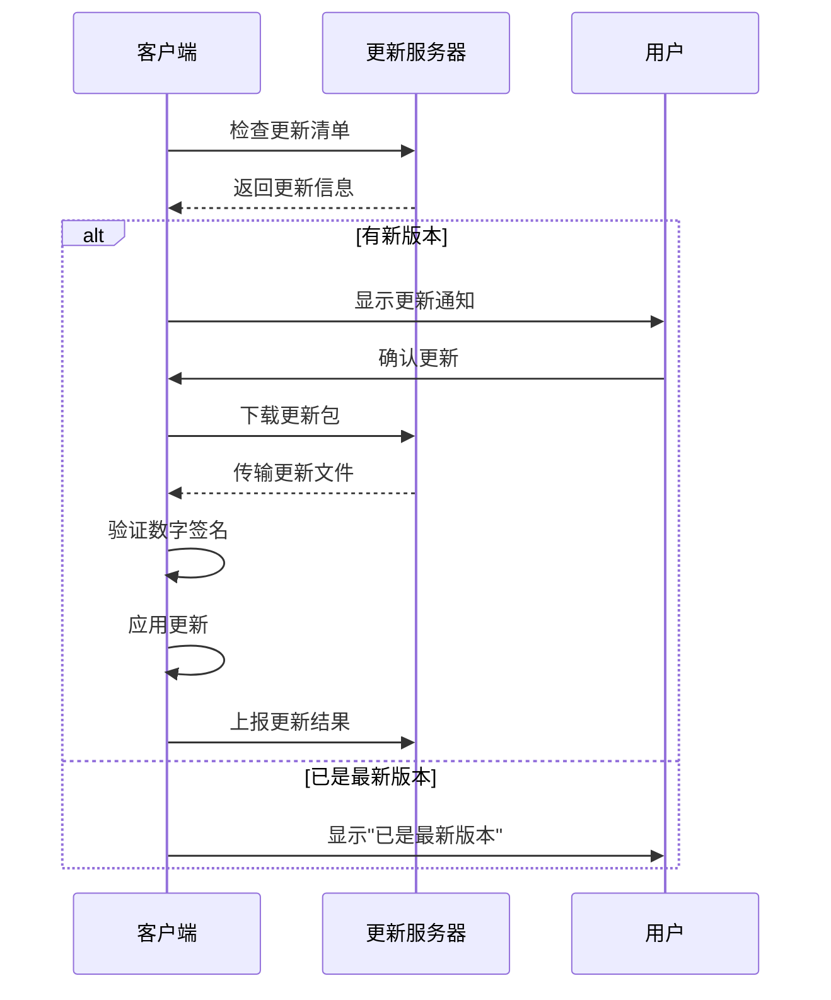

# Duck Client 自更新功能文档

本文档详细介绍了 Duck Client 的客户端自更新功能，包括 Tauri 桌面应用和 CLI 命令行工具的自更新机制。

## 📋 目录

- [功能概述](#功能概述)
- [技术架构](#技术架构)
- [Tauri 桌面应用更新](#tauri-桌面应用更新)
- [CLI 工具更新](#cli-工具更新)
- [服务端 API 规范](#服务端-api-规范)
- [安全机制](#安全机制)
- [使用指南](#使用指南)
- [故障排除](#故障排除)
- [新增自动部署功能](#新增自动部署功能)

## 🎯 功能概述

Duck Client 的自更新功能提供了完整的客户端版本管理解决方案：

### ✨ 主要特性

- **🔄 双端支持**: 同时支持 Tauri 桌面应用和 CLI 工具的自更新
- **🔒 安全更新**: 基于数字签名验证，确保更新包的完整性和安全性
- **📊 进度显示**: 实时显示下载和安装进度
- **🌐 跨平台**: 支持 Windows、macOS 和 Linux
- **📈 遥测上报**: 自动上报更新结果，便于统计和监控
- **🚫 用户控制**: 所有更新都需要用户明确同意，绝不自动进行

### 🏗️ 技术栈

- **Tauri 桌面应用**: 使用官方 `tauri-plugin-updater` 插件
- **CLI 工具**: 使用 `self-update` crate（备用方案）
- **前端**: React + 现代化 UI 组件
- **后端**: Rust + Tokio 异步运行时

## 🏛️ 技术架构

### 🔄 更新流程



### 📂 组件架构

```
duck_client/
├── duck-tauri/                    # Tauri 桌面应用
│   ├── src-tauri/
│   │   ├── Cargo.toml             # 包含 updater 插件依赖
│   │   ├── tauri.conf.json        # 更新器配置
│   │   └── src/lib.rs             # 更新逻辑实现
│   └── src/
│       ├── components/
│       │   └── UpdateManager.jsx  # React 更新管理组件
│       └── App.jsx                # 主应用界面
├── duck-cli/                      # CLI 命令行工具
│   └── src/lib.rs                 # CLI 自更新逻辑
└── client-core/                   # 共享核心逻辑
    └── src/api.rs                 # API 客户端
```

## 🖥️ Tauri 桌面应用更新

### ⚙️ 配置

#### 1. Cargo.toml 依赖

```toml
[dependencies]
tauri-plugin-updater = "2"
tauri-plugin-process = "2"
```

#### 2. tauri.conf.json 配置

```json
{
  "plugins": {
    "updater": {
      "endpoints": [
        "https://your-server.com/api/v1/client/updates/manifest/{{target}}-{{arch}}/{{current_version}}"
      ],
      "dialog": true,
      "pubkey": "您的公钥字符串"
    }
  }
}
```

#### 3. 权限配置

```json
{
  "permissions": [
    "core:default",
    "opener:default",
    "updater:default"
  ]
}
```

### 🎮 功能特性

- **📱 现代化 UI**: 美观的 React 界面，支持暗色主题
- **📊 实时进度**: 显示下载进度条和状态信息
- **🔔 智能通知**: 自动检测更新，用户友好的提示
- **⚡ 事件驱动**: 基于 Tauri 事件系统的实时状态更新

### 💻 React 组件使用

```jsx
import UpdateManager from './components/UpdateManager';

// 在应用中使用
<UpdateManager />
```

## 🖱️ CLI 工具更新

### ⚙️ 配置

CLI 工具的自更新基于与 Tauri 应用相同的服务端 API，但使用简化的实现方式。

### 📱 使用方法

```bash
# 检查并更新 CLI 工具
duck-cli self-update

# 输出示例：
🔍 检查更新...
当前版本: 0.1.0
平台: macos-aarch64
🎉 发现新版本: 0.2.0
更新说明:
- 修复了重要的安全漏洞
- 改进了性能
- 新增了备份功能

是否立即更新到版本 0.2.0? (y/N): y
🚀 开始更新过程...
📥 下载更新包...
✅ 下载完成
🔒 验证更新包...
✅ 验证通过
💾 备份当前版本...
⚙️ 应用更新...
🎉 更新成功完成!
版本: 0.1.0 -> 0.2.0
⚠️ 请重新启动 CLI 工具以使用新版本
```

### ⚡ 功能特性

- **🔍 版本检测**: 自动检测当前版本和平台信息
- **💾 安全备份**: 更新前自动备份当前版本
- **🔒 签名验证**: 验证更新包的完整性
- **📊 结果上报**: 自动向服务端上报更新结果

## 🌐 服务端 API 规范

### 📋 API 端点

#### 1. 获取客户端更新清单

```http
GET /api/v1/client/updates/manifest
```

**查询参数:**
- `platform`: 平台标识 (如: `macos-aarch64`)
- `current_version`: 当前版本号

**响应格式 (Tauri 兼容):**
```json
{
  "version": "v1.2.0",
  "notes": "修复了一些关键 bug，并优化了启动性能。",
  "pub_date": "2025-06-25T12:00:00Z",
  "platforms": {
    "macos-aarch64": {
      "signature": "数字签名内容",
      "url": "https://your-server.com/downloads/client/1.2.0/duck-client.app.tar.gz"
    },
    "windows-x86_64": {
      "signature": "数字签名内容",
      "url": "https://your-server.com/downloads/client/1.2.0/duck-client.msi.zip"
    }
  }
}
```

#### 2. 上报客户端更新结果

```http
POST /api/v1/history/client-self-upgrades
```

**请求体:**
```json
{
  "from_version": "0.1.0",
  "to_version": "0.2.0",
  "status": "SUCCESS",
  "details": ""
}
```

## 🔐 安全机制

### 🔑 数字签名验证

- **Tauri 应用**: 使用官方签名机制，基于 `.sig` 文件验证
- **CLI 工具**: 支持自定义签名验证逻辑
- **密钥管理**: 公钥嵌入客户端，私钥安全存储在服务端

### 🛡️ 安全最佳实践

1. **🔒 HTTPS 传输**: 所有更新下载都通过 HTTPS 进行
2. **✅ 完整性检查**: 验证下载文件的哈希值
3. **👤 用户授权**: 所有更新都需要用户明确同意
4. **💾 自动备份**: 更新前自动备份当前版本
5. **📝 详细日志**: 记录所有更新操作，便于审计

## 📖 使用指南

### 🚀 快速开始

#### 1. 配置服务端
```bash
# 配置更新服务器地址
vim config.toml
```

```toml
[endpoints]
base_url = "https://your-server.com"

[endpoints.client_self_update]
manifest_uri = "/api/v1/client/updates/manifest"
```

#### 2. 启动 Tauri 应用
```bash
cd duck-tauri
deno task dev
```

#### 3. 使用 CLI 工具
```bash
# 构建 CLI
cargo build --bin duck-cli

# 检查更新
./target/debug/duck-cli self-update
```

### 🎛️ 高级配置

#### 自定义更新检查频率

在 Tauri 应用中，可以设置自动检查更新的频率：

```javascript
// 每24小时检查一次更新
setInterval(async () => {
  try {
    const status = await invoke('check_for_updates');
    if (status.available) {
      // 显示更新通知
    }
  } catch (error) {
    console.error('检查更新失败:', error);
  }
}, 24 * 60 * 60 * 1000);
```

## 🔧 故障排除

### ❗ 常见问题

#### 1. 网络连接错误
```
❌ 检查更新失败: HTTP 请求错误: error decoding response body
```

**解决方案:**
- 检查网络连接
- 验证服务器地址配置
- 确认服务端 API 正常运行

#### 2. 签名验证失败
```
❌ 更新失败: 签名验证失败
```

**解决方案:**
- 检查公钥配置是否正确
- 确认更新包签名完整性
- 联系管理员重新签名更新包

#### 3. 权限不足
```
❌ 更新失败: 权限不足
```

**解决方案:**
- 以管理员身份运行应用
- 检查文件系统权限
- 确保更新目录可写

### 🐛 调试模式

启用详细日志：

```bash
# CLI 工具
RUST_LOG=debug duck-cli self-update

# Tauri 应用
# 在开发模式下自动启用调试日志
```

### 📞 获取帮助

如果遇到问题，请：

1. 🔍 检查日志文件
2. 📋 收集错误信息
3. 🌐 查看网络连接状态
4. 💌 联系技术支持

## 🎯 最佳实践

### 📅 版本发布流程

1. **🏗️ 构建**: 构建新版本的客户端
2. **🔐 签名**: 使用私钥对更新包进行签名
3. **📤 上传**: 将更新包和清单上传到服务器
4. **🧪 测试**: 在测试环境验证更新流程
5. **📢 发布**: 更新服务端清单，推送给用户

### 🎛️ 配置管理

- **🌍 环境隔离**: 开发、测试、生产环境使用不同的更新服务器
- **🎚️ 渐进发布**: 支持灰度发布，逐步推送更新
- **📊 监控告警**: 监控更新成功率，及时发现问题

---

## 📝 更新日志

### v0.1.0 (2025-06-25)
- ✨ 初始版本发布
- 🔄 支持 Tauri 桌面应用自更新
- 🖱️ 支持 CLI 工具自更新
- 🔒 集成数字签名验证
- 📊 支持更新进度显示
- 📈 支持遥测数据上报

---

**注意**: 这是一个开发中的功能，部分特性可能还在完善中。请在生产环境使用前进行充分测试。

## v1.0.10 - 新增自动部署功能

### 🚀 新增功能

#### 1. 自动部署服务
- **一键初始化并部署**: 首次使用时，可以一键完成初始化和自动部署
- **自动部署**: 已初始化环境中，可以单独执行自动部署
- **自定义端口**: 支持指定部署端口号（默认3000）

#### 2. 三种部署方式
1. **一键初始化并部署** (`duck-cli init + auto-upgrade-deploy run`)
   - 适用于首次使用
   - 自动创建配置文件和数据库
   - 从服务器拉取最新的Docker服务
   - 自动部署到指定端口

2. **仅初始化客户端** (`duck-cli init`)
   - 仅创建配置文件和数据库
   - 不执行自动部署

3. **自动部署服务** (`duck-cli auto-upgrade-deploy run`)
   - 适用于已初始化的环境
   - 从服务器拉取最新的Docker服务
   - 自动部署到指定端口

### 📍 功能位置

#### 系统设置页面
- **数据目录管理**部分显示自动部署相关选项
- 未初始化时：显示"一键初始化并部署"和"仅初始化客户端"按钮
- 已初始化时：显示"自动部署服务"按钮
- 支持自定义端口号设置

#### 升级管理页面
- **版本检查**部分新增"自动部署服务"按钮
- 可在查看版本信息的同时进行部署操作
- 支持在部署前设置端口号

### 🔧 技术实现

#### 后端 Tauri 命令
```rust
// 自动部署服务
#[command]
async fn auto_deploy_service(port: Option<u16>) -> Result<String, String>

// 一键初始化并部署
#[command]
async fn init_and_deploy(port: Option<u16>) -> Result<String, String>
```

#### 前端 API 调用
```typescript
// 自动部署
export async function autoDeployService(port?: number)

// 一键初始化并部署  
export async function initAndDeploy(port?: number)
```

### 💡 使用流程

1. **首次使用推荐流程**:
   - 设置工作目录
   - 点击"一键初始化并部署"
   - 设置部署端口（默认3000）
   - 等待自动完成初始化和部署

2. **已有环境更新流程**:
   - 在设置页面或升级管理页面
   - 点击"自动部署服务"
   - 设置部署端口
   - 等待自动部署完成

### ✅ 状态反馈
- 操作前确认对话框，显示详细操作说明
- 操作过程中按钮显示加载状态
- 操作完成后显示成功/失败消息
- 自动刷新目录状态信息

### 🎯 用户价值
- **简化操作**: 一键完成复杂的初始化和部署流程
- **提高效率**: 减少手动执行命令行操作
- **用户友好**: 图形化界面，操作直观
- **端口灵活**: 支持自定义部署端口，避免冲突

---

## 历史版本

### v1.0.9
- 完善数据目录管理功能
- 添加清理缓存功能
- 优化模块结构设计

### v1.0.8
- 基础桌面应用框架
- 六大核心页面实现
- Tauri后端集成 