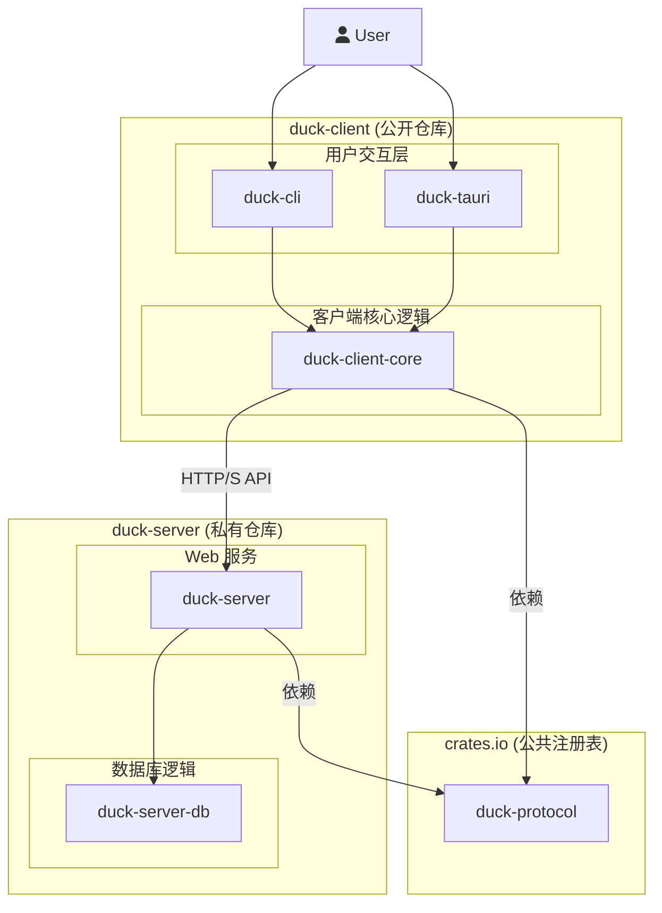

# 系统设计方案：自动化服务管理与升级
[TOC]
## 1. 概述

本方案旨在设计一个 **自动化服务管理与升级平台**，用于集中管理和维护大规模部署的、基于 Docker Compose 的服务实例。它通过一个中心化的服务端和跨平台的客户端，替代了传统的手动脚本维护模式，提供了自动化、可调度、可监控的全新运维体验。

平台支持 **Tauri 桌面应用** 和 **CLI 命令行工具** 两种客户端形态，满足不同用户场景下的操作需求。

## 2. 核心功能

平台的核心功能旨在实现对客户端及其托管服务的全生命周期管理。

-   **客户端自动注册与管理**: 客户端首次启动时会自动向服务端注册，并获得唯一身份标识，便于服务端进行统一管理和追踪。
-   **服务版本检查与分发**: 服务端统一管理 Docker 服务和客户端自身的版本清单，客户端可随时查询并获取最新版本信息。
-   **一键式与预约式升级**:
    -   **一键升级**: 用户可立即触发 Docker 服务的升级流程。
    -   **预约升级**: 支持用户将升级任务安排在业务低谷时段（如凌晨）自动执行，最大化减少对业务的影响。
-   **自动化备份与恢复**: 在执行关键操作（如升级）前，系统会自动备份关键数据，确保数据安全。
-   **远程遥测与状态监控**: 客户端会向服务端上报升级历史（包括服务和客户端自身）、操作结果等遥测数据，便于中心化地监控所有节点的健康状况和版本分布。
-   **系统公告与通知**: 客户端可定时拉取服务端的最新公告消息（次要功能，后期开发）。
-   **客户端自我更新**: 采用成熟的更新机制，实现桌面客户端和CLI工具的安全、自动更新。
    参考tauri官方文档: https://tauri.org.cn/plugin/updater/#static-json-file
-   **跨平台与双模式**: 客户端支持 Windows, macOS, 和 Linux，并同时提供图形界面 (Tauri) 和命令行 (CLI) 两种交互方式。

## 3. 技术架构

本项目采用现代化的 Rust 技术栈，构建一个健壮、高性能且易于维护的 **客户端-服务端** 架构。该架构旨在实现对大规模客户端群体的集中化管理与服务分发。

-   **服务端 (Update Server)**: 作为整个平台的大脑，负责客户端注册、版本管理、任务调度、数据收集和消息分发。
-   **客户端 (Client)**: 部署在每个服务节点上，负责执行来自服务端的指令（如升级、备份），上报本地状态，并为最终用户提供交互界面 (Tauri/CLI)。

### 3.1. 技术选型

#### 3.1.1. 服务端 (Update Server)

-   **核心框架**: `Tokio` + `Axum`
    -   **描述**: 使用 `Tokio` 作为异步运行时，`Axum` 作为 Web 框架来构建一个轻量级的 HTTP 更新服务器。
    -   **选型理由**: 高性能、高并发、安全且模块化，与 Rust 生态无缝集成。
    -   **核心职责**: 提供服务与客户端的更新清单 (`manifest.json`)、托管更新包、处理客户端注册和遥测数据上报。

#### 3.1.2. 客户端 (Desktop App & CLI)

-   **核心逻辑层 (`common` Crate)**: 为实现代码复用，所有核心业务逻辑（配置管理、Docker交互、备份、更新、数据库操作）都将抽象到一个共享的 `common` crate 中。
-   **桌面应用框架**: `Tauri`
    -   **描述**: 使用 `Tauri` 作为跨平台桌面应用的解决方案。
    -   **选型理由**: 轻量、安全、高性能，并允许使用 Rust 编写所有核心业务逻辑。
-   **前端方案**: `React`
    -   **描述**: 使用 `React` 框架构建响应式的用户界面。
-   **本地数据存储**: `SQLx` + `SQLite`
    -   **描述**: 使用 `SQLite` 作为本地数据库，通过 `SQLx` 进行异步、类型安全的数据库操作。
    -   **选型理由**: `SQLite` 轻量、无服务器，适合桌面应用；`SQLx` 提供编译时 SQL 查询检查，保证代码健壮性。
-   **客户端自我更新**:
    -   **Tauri**: 使用官方的 `tauri-plugin-updater`。
    -   **CLI**: 使用 `self-update` crate。
-   **HTTP 通信**: `reqwest`
    -   **描述**: 所有与服务端 API 的通信将使用 `reqwest` 库。我们会创建一个 `ApiClient` 包装器来统一处理 `client_id` 注入和错误处理。

### 3.2. 客户端命令行工具 (`duck_client_cli`)

-   **参数解析**: 使用 `clap` 库解析命令行参数。
-   **核心命令**:
    -   `duck-cli check-update`: 检查服务或客户端的新版本。
    -   `duck-cli upgrade`: 执行服务升级流程。
    -   `duck-cli backup`: 手动执行一次完整的系统备份。
    -   `duck-cli list-backups`: 列出所有可用的本地备份。
    -   `duck-cli rollback <BACKUP_IDENTIFIER>`: 从指定的备份恢复系统。
    -   `duck-cli start | stop | status`: 控制和查看 Docker 服务状态。
    -   `duck-cli self-update`: 检查并更新 CLI 工具自身。

## 4. 项目结构建议 (前后端分离)

考虑到服务端代码的闭源需求以及客户端的开源计划，我们对项目结构进行调整，从原有的单一Cargo Workspace拆分为两个完全独立的Rust工程：`duck-client` 和 `duck-server`。它们之间的通信纽带是一个独立发布到 `crates.io` 的 `duck-protocol` 共享库。

这种结构提供了最大的灵活性和最清晰的权责边界，使得客户端可以独立开发、构建和发布，而服务端则保持私有。

### 4.1. 模块依赖关系图

下图清晰地展示了分离后的项目依赖关系：



### 4.2. 项目与模块职责说明

-   `duck-protocol` (**公共 API 协议库**):
    -   **职责**: 定义所有客户端与服务端之间通信的数据结构（使用 `serde`）。这是一个纯数据结构库，不包含任何业务逻辑。它将被独立发布到 **`crates.io`**，供 `duck-client` 和 `duck-server` 两个项目共同依赖。
    -   **代码状态**: **公开**。

-   `duck-client` (**客户端工程**):
    -   **职责**: 一个独立的 Cargo Workspace，包含所有客户端相关的代码。此项目将**在 GitHub 上开源**。
    -   **内部模块**:
        -   `duck-client-core`: 实现所有客户端的核心业务逻辑，如 API 通信、服务升级、备份恢复、数据库管理等。
        -   `duck-cli`: 轻量级的命令行"外壳"，负责解析参数并调用 `client-core` 中的功能。
        -   `duck-tauri`: 轻量级的图形界面"外壳"，通过 Tauri 命令调用 `client-core` 中的功能并与前端交互。
        使用 deno , react 前端技术,使用的 tauri 前端

-   `duck-server` (**服务端工程**):
    -   **职责**: 一个独立的 Cargo Workspace，包含所有服务端的代码。此项目将作为**私有仓库**进行管理。
    -   **内部模块**:
        -   `duck-server`: 实现所有 API 端点的 Axum Web 服务。
        -   `duck-server-db`: 封装所有与服务端数据库的交互逻辑。

### 4.3. 文件夹结构

#### `duck-client` (客户端项目)
```
duck_client/
├── Cargo.toml           # Workspace配置
├── config.toml          # 用户配置文件
├── duck-tauri  # tauri桌面app ui
├── client-core # 核心业务逻辑库
├── duck-cli   # 命令行,同时提供 lib,可以供 duck-tauri 使用.不需要UI的时候,只使用 cli command ,编译此模块
└── spec/
    ├── Design.md 设计文档
    └── task.md   开发任务文档
```

#### `duck-server` (服务端项目)
```
/duck-server/
|-- Cargo.toml              # Workspace: 定义 server, server-db
|-- README.md
|-- .gitignore
|
|-- server/       # Axum Web 服务
|-- server-db/    # 数据库交互逻辑
|-- migrations/         # 数据库迁移文件
```

## 5. 数据持久化设计 (Database Design)

我们将分别在客户端和服务端使用数据库来持久化关键数据。

### 5.1. 客户端数据库 (SQLite)

客户端使用一个本地的 `SQLite` 数据库 (`history.db`) 来存储用户配置、历史记录和身份信息。

#### 5.1.1. 表结构: `client_identity`

用于存储客户端自身的唯一标识，确保表中只有一条记录。

| 字段名      | 类型      | 约束                | 描述                         |
| ----------- | --------- | ------------------- | ---------------------------- |
| `id`        | `INTEGER` | `PRIMARY KEY`       | 唯一标识，确保只有一行记录。 |
| `client_uuid` | `TEXT`    | `NOT NULL`, `UNIQUE`| 客户端的 UUID 标识。         |
| `created_at`| `DATETIME`| `NOT NULL`          | 记录创建时间。               |

#### 5.1.2. 表结构: `backups`

用于持久化管理备份历史。

| 字段名          | 类型      | 约束                | 描述                                           |
| --------------- | --------- | ------------------- | ---------------------------------------------- |
| `id`            | `INTEGER` | `PRIMARY KEY`       | 备份记录的唯一标识符。                         |
| `file_path`     | `TEXT`    | `NOT NULL`, `UNIQUE`| 备份文件的绝对路径。                           |
| `service_version` | `TEXT`    | `NOT NULL`          | 备份时服务的版本号。                           |
| `backup_type`   | `TEXT`    | `NOT NULL`          | 备份类型（如 `manual`, `pre-upgrade`）。       |
| `status`        | `TEXT`    | `NOT NULL`          | 备份状态（如 `completed`, `failed`）。         |
| `created_at`    | `DATETIME`| `NOT NULL`          | 备份创建时间。                                 |

#### 5.1.3. 表结构: `scheduled_tasks`

此表用于存储所有待执行的计划任务，核心是实现服务的预约升级。

**业务逻辑**: 为了确保同一时间只有一个有效的预约升级，应用在创建新的 `SERVICE_UPGRADE` 任务前，必须先将所有状态为 `PENDING` 的旧升级任务更新为 `CANCELLED` 状态。

| 字段名           | 类型       | 约束                         | 描述                                                                         |
| ---------------- | ---------- | ---------------------------- | ---------------------------------------------------------------------------- |
| `id`             | `INTEGER`  | `PRIMARY KEY`                | 任务的唯一标识符。                                                           |
| `task_type`      | `TEXT`     | `NOT NULL`                   | 任务类型（目前为 `SERVICE_UPGRADE`，未来可扩展）。                           |
| `target_version` | `TEXT`     | `NOT NULL`                   | 计划升级到的服务版本号。                                                     |
| `scheduled_at`   | `DATETIME` | `NOT NULL`                   | 用户指定的任务执行时间 (UTC)。                                               |
| `status`         | `TEXT`     | `NOT NULL`                   | 任务状态 (`PENDING`, `IN_PROGRESS`, `COMPLETED`, `FAILED`, `CANCELLED`)。 |
| `details`        | `TEXT`     |                              | 存储额外信息，如失败时的错误日志。                                           |
| `created_at`     | `DATETIME` | `NOT NULL`, `DEFAULT NOW()`  | 任务记录的创建时间。                                                         |
| `completed_at`   | `DATETIME` |                              | 任务完成、失败或取消的时间。                                                 |

### 5.2. 服务端数据库

服务端数据库用于管理所有客户端的信息、版本发布和升级历史。

#### 5.2.1. 表结构: `clients`

记录所有已注册的客户端实例。

| 字段名           | 类型       | 约束                         | 描述                                       |
| ---------------- | ---------- | ---------------------------- | ------------------------------------------ |
| `id`             | `INTEGER`  | `PRIMARY KEY`                | 内部自增ID。                               |
| `client_uuid`    | `UUID`     | `NOT NULL`, `UNIQUE`         | 客户端生成的唯一标识符 (`X-Client-ID`)。   |
| `os_type`        | `TEXT`     |                              | 操作系统类型 (e.g., "windows")。           |
| `os_version`     | `TEXT`     |                              | 操作系统版本。                             |
| `architecture`   | `TEXT`     |                              | CPU 架构 (e.g., "x86_64")。                |
| `first_seen_at`  | `DATETIME` | `NOT NULL`, `DEFAULT NOW()`  | 首次注册时间。                             |
| `last_seen_at`   | `DATETIME` | `NOT NULL`                   | 最后一次活跃时间（每次API调用时更新）。    |

#### 5.2.2. 表结构: `service_upgrade_history`

记录每个客户端 **对 Docker 服务** 的升级历史。

| 字段名         | 类型      | 约束                         | 描述                                     |
| -------------- | --------- | ---------------------------- | ---------------------------------------- |
| `id`           | `INTEGER` | `PRIMARY KEY`                | 记录的唯一ID。                           |
| `client_id`    | `INTEGER` | `NOT NULL`, `FK to clients.id` | 关联到执行升级的客户端。                 |
| `from_version` | `TEXT`    | `NOT NULL`                   | 升级前的 **服务** 版本。                       |
| `to_version`   | `TEXT`    | `NOT NULL`                   | 升级后的 **服务** 版本。                       |
| `status`       | `TEXT`    | `NOT NULL`                   | 升级结果 (`SUCCESS`, `FAILED`)。         |
| `details`      | `TEXT`    |                              | 失败时的详细错误信息。                   |
| `upgraded_at`  | `DATETIME`| `NOT NULL`, `DEFAULT NOW()`  | 升级操作发生的时间。                     |

#### 5.2.3. 表结构: `client_self_upgrade_history`

记录 **客户端自身** 的更新历史，用于追踪客户端的迭代和采纳率。

| 字段名         | 类型      | 约束                         | 描述                                     |
| -------------- | --------- | ---------------------------- | ---------------------------------------- |
| `id`           | `INTEGER` | `PRIMARY KEY`                | 记录的唯一ID。                           |
| `client_id`    | `INTEGER` | `NOT NULL`, `FK to clients.id` | 关联到执行升级的客户端。                 |
| `from_version` | `TEXT`    | `NOT NULL`                   | 升级前的 **客户端** 版本。                   |
| `to_version`   | `TEXT`    | `NOT NULL`                   | 升级后的 **客户端** 版本。                   |
| `status`       | `TEXT`    | `NOT NULL`                   | 升级结果 (`SUCCESS`, `FAILED`)。         |
| `details`      | `TEXT`    |                              | 失败时的详细错误信息。                   |
| `upgraded_at`  | `DATETIME`| `NOT NULL`, `DEFAULT NOW()`  | 升级操作发生的时间。                     |

## 6. 配置文件设计

我们设计了一个功能全面的配置结构，它能清晰地管理版本、API端点、备份和公告等所有信息。

```toml
# [versions]
# 统一管理客户端和服务端的版本号
[versions]
client = "0.1.0"   # duck-cli 工具自身的当前版本
service = "1.1.0"  # 已部署的 Docker 服务的当前版本

# [docker]
# Docker 相关配置
[docker]
compose_file = "./docker/docker-compose.yml"

# [endpoints]
# 中心化的 API 端点管理
[endpoints]
base_url = "https://your-server.com"
# Docker 服务更新相关的 API
[endpoints.service_update]
manifest_uri = "/api/v1/docker/update/manifest"

# 客户端自更新相关的 API (为中国大陆访问优化)
[endpoints.client_self_update]
manifest_uri = "/api/v1/client/update/manifest"

# 获取公告的 API
[endpoints.announcements]
list_uri = "/api/v1/announcements"

# [backup]
# 备份相关的所有配置
[backup]
# 备份文件的统一存储目录。用户可随时修改。
storage_dir = "./backups"
```

## 7. 核心流程设计

### 7.1. 客户端注册与识别

1.  **首次启动**: 客户端在首次启动时，检查本地是否存在 `client_id`。若不存在，则生成一个 UUID，收集系统信息（OS、架构），并调用服务端 `POST /api/v1/clients/register` 接口进行注册。成功后，将 `client_id` 持久化到本地 SQLite 数据库。
2.  **后续请求**: 所有对服务端的 API 请求，都在请求头中自动添加 `X-Client-ID`，用于身份识别。

### 7.2. 更新分发机制：基于清单的差量更新

为提升更新效率，我们采用基于文件哈希比对的差量更新机制。

#### 7.2.1. 服务端流程

1.  **打包与上传**: 管理员将包含所有部署文件的文件夹（`docker-compose.yml`, `.tar` 镜像包等）压缩成 `docker.zip` 并上传。
2.  **生成清单**: 服务端自动解压 `zip` 包，遍历所有文件，计算每个文件的哈希值（如 SHA256），和历史版本对比，并生成一个文件清单列表，然后根据清单列表，进行打包 .zip 文件。同时，提供增量和全量两种更新包。
注： 如果没有历史版本，第一次升级，则是全量升级方式， 增量升级的内容，和全量升级的 .zip 包内容是一样的。

最终提供给用户使用的结构 `manifest.json` ,用于客户端升级使用,根据自己选择的升级方式,来下载对应的文件,进行升级。

#### 7.2.2. `manifest.json` 结构设计

```json
{
  "version": "1.2.0",
  "release_date": "2025-06-25T10:00:00Z",
  "channel": "stable",
  "notes": "### 新增功能\n- 新增了数据导出模块。",

  "packages": {
    "full": {
      "url": "http://xxxxx/1.2.0/docker.zip",
      "hash": "...",
      "size": 600000000
    },
    "incremental": {
      "url": "http://xxxx/1.2.0/incremental.zip",
      "hash": "...",
      "size": 5000000
    }
  }
}
```

-   **核心字段**: `version`, `notes` (更新日志),  `packages` (全量与增量更新包的下载信息)。

### 7.3. 服务升级流程 (客户端视角)

系统的核心原则是：**检查是自动的，但升级永远是手动的、需经用户明确同意的。**

1.  **检查更新**: 客户端定期或手动从服务端获取 `manifest.json`。
2.  **决策与确认**: 客户端将服务端的清单与本地文件进行哈希比对，智能判断应采用增量或全量更新。向用户展示版本信息和更新日志，请求最终确认。
3.  **执行升级**:
    1.  **执行双重备份**:
        -   **系统备份**: 完整备份整个 `docker` 目录。
        -   **数据备份**: 单独备份 `docker/data` 目录，为数据恢复提供双重保障。
    2.  **停止服务**: 执行 `docker-compose down`。
    3.  **下载与应用更新**: 下载增量或全量包，解压并覆盖本地文件。
    4.  **加载新镜像**: 执行 `docker load -i <path-to-image.tar>`。
    5.  **启动新服务**: 执行 `docker-compose up -d`。
    6.  **健康检查与清理**: 检查服务是否成功启动，然后清理下载的临时文件。
    7.  **完成**: 通知用户升级成功，并更新本地记录的版本号。

### 7.4. 预约升级流程

1.  **用户决策**: 当检测到新版本后，UI 界面提供"立即升级"和"预约升级"选项。
2.  **任务调度**: 若用户选择预约，可指定一个未来的时间点（如次日凌晨2:00）。该任务（类型、版本、执行时间）被记录到本地 SQLite 的 `scheduled_tasks` 表中。
3.  **后台执行**: Tauri 后端的轻量级调度器会定时检查任务表。当到达指定时间，它会自动触发完整的[服务升级流程](#73-服务升级流程-客户端视角)。
4.  **结果反馈**: 升级结果（成功/失败及日志）被记录到数据库。用户下次打开应用时会收到通知。

### 7.5. 客户端自升级流程

1.  **检查版本**: 客户端启动时，访问服务端的客户端更新清单。
2.  **提示更新**: 若有新版本，提示用户并展示更新日志。
3.  **下载与替换**: 用户确认后，Tauri 应用使用 `tauri-plugin-updater`，CLI 工具使用 `self-update` Crate，自动完成下载、替换和重启的流程。

### 7.6. 备份与恢复机制

为了提升备份系统的健壮性、灵活性和可维护性，我们对备份机制进行重构，核心思想是将 **动态的备份历史** 与 **静态的用户配置** 分离。

#### 7.6.1. 备份内容

为简化操作并确保完整性，`duck-cli backup` 命令将默认备份 **整个 Docker 服务目录**（即 `docker-compose.yml` 文件所在的目录）。这包括了所有服务配置、数据卷映射等，从而保证了备份的完整性和一致性。

#### 7.6.2. 备份历史存储

所有备份操作的元数据（历史记录）将不再写入 `config.toml`，而是存储在一个独立的、由程序管理的本地数据库（`backups` 表）中。

-   **技术选型**: 我们将使用 **`sqlx`** crate，并启用其 **`sqlite`** 特性。
-   **优点**:
    -   **数据解耦**: 彻底分离了用户静态配置和程序动态生成的数据。
    -   **高性能查询**: 可以轻松地对备份历史进行复杂的查询、排序和管理。
    -   **高扩展性**: 未来可以方便地为备份记录增加更多维度的信息（如备份大小、状态、类型等）。

#### 7.6.3. `storage_dir` 变更的智能处理

我们认识到用户可能会更改备份目录 (`config.toml` 中的 `backup.storage_dir`)。为了提供无缝的体验，CLI 将智能处理此变更：

1.  **变更检测**: 每次启动时，CLI 会读取 `config.toml` 中的 `storage_dir`，并与数据库中记录的（或一个状态文件中缓存的）上一次使用的路径进行比较。
2.  **用户确认**: 如果检测到路径不一致，程序将主动询问用户：
    > "检测到您的备份存储目录已从 `<old_path>` 更改为 `<new_path>`。是否需要将所有历史备份文件迁移至新目录？\n**警告**: 此操作可能需要较长时间并消耗大量磁盘I/O，请确保您有足够的时间和磁盘空间。(y/N)"
3.  **执行迁移**:
    -   如果用户输入 `y`，CLI 将开始迁移过程：
        1.  将旧目录下的所有备份文件移动到新目录。
        2.  更新数据库中 **所有** 备份记录的 `file_path` 字段，使其指向新的文件位置。
        3.  完成后，将新路径记录为当前使用的路径。
    -   如果用户输入 `n`，CLI 将不会移动旧文件。旧的备份记录依然指向旧路径（可能导致 `rollback` 失败），但所有 **新的备份** 将被创建在 `config.toml` 指定的新目录中。

#### 7.6.4. 回滚流程

1.  **查找备份**: 用户通过 `duck-cli list-backups` 查看所有可用的本地备份。
2.  **执行回滚**: 用户执行 `duck-cli rollback <BACKUP_IDENTIFIER>` 命令。
3.  **用户确认**: 系统会警告此操作将覆盖当前文件，并请求最终确认。
4.  **执行恢复**: 停止当前服务，清空相关目录，然后将指定的备份包完整解压到原位。
5.  **重启服务**: 使用恢复后的文件和镜像重新启动服务。

## 8. 服务端 API 设计

### 8.1. 全局要求

-   **基础 URL**: 所有 API 路径均以 `https://your-server.com/api/v1` 为前缀。
-   **认证**: 除注册接口外，所有发向服务端的请求都必须在 HTTP Header 中包含 `X-Client-ID: <uuid>`，否则将被拒绝 (`400 Bad Request`)。服务端会根据此 ID 更新客户端的 `last_seen_at` 时间戳。
-   **通用响应**: 服务端在发生错误时，应返回一个标准的 JSON 错误对象：
    ```json
    {
      "error_code": "RESOURCE_NOT_FOUND",
      "message": "The requested resource was not found."
    }
    ```

### 8.2. 客户端管理 (Client Management)

#### 8.2.1. 注册客户端

-   **Endpoint**: `POST /clients/register`
-   **描述**: 客户端首次启动时调用，用于向服务端注册自己。
-   **请求体 (JSON)**:
    ```json
    {
      "client_uuid": "a1b2c3d4-e5f6-7890-1234-567890abcdef",
      "os_type": "macos",
      "os_version": "14.5",
      "architecture": "aarch64"
    }
    ```
-   **成功响应**: `201 Created` (空响应体)
-   **失败响应**:
    -   `400 Bad Request`: 请求体格式错误。
    -   `409 Conflict`: 该 `client_uuid` 已被注册。

### 8.3. 更新与分发 (Updates & Distribution)

#### 8.3.1. 获取 Docker 服务更新清单

-   **Endpoint**: `GET /services/updates/manifest`
-   **描述**: 客户端定期调用此接口，检查是否有新的 Docker 服务版本。
-   **查询参数**:
    -   `current_version` (String, 必需): 客户端当前的服务版本号。
-   **成功响应 (200 OK)**: 返回 `manifest.json` 文件内容，结构见 [7.2.2. `manifest.json` 结构设计](#722-manifestjson-结构设计)。如果版本已是最新，可以返回 `304 Not Modified`。

#### 8.3.2. 获取客户端自我更新清单

-   **Endpoint**: `GET /client/updates/manifest`
-   **描述**: 客户端启动时调用，检查自身是否有新版本。此接口返回的 JSON 结构严格遵循 [Tauri Updater 插件的规范](https://tauri.app/v1/guides/distribution/updater/)，以确保兼容性。
-   **查询参数**:
    -   `platform` (String, 必需): 客户端平台 (e.g., `windows-x86_64`, `darwin-aarch64`)。
    -   `current_version` (String, 必需): 客户端当前的版本号。
-   **成功响应 (200 OK)**: 返回 Tauri Updater 兼容的 JSON 清单。
    -   `version`: 新版本的版本号 (e.g., `"v1.2.0"`)。
    -   `notes`: 本次更新的发行说明。
    -   `pub_date`: 版本发布的 ISO 8601 格式日期 (e.g., `"2025-06-25T12:00:00Z"`)。
    -   `platforms`: 一个对象，包含了不同平台和架构的更新包信息。
        -   `signature`: **极其重要**。这是由 Tauri 打包工具生成的 `.sig` 文件的 **内容** (不是文件名或路径)。Tauri Updater 会用它来验证下载的更新包是否被篡改，是安全性的核心保障。
        -   `url`: 新版本更新包的下载地址。根据用户要求，这会指向我们自己服务器的地址。

    **示例 (包含多个平台):**
    ```json
    {
      "version": "v1.2.0",
      "notes": "修复了一些关键 bug，并优化了启动性能。",
      "pub_date": "2025-06-25T12:00:00Z",
      "platforms": {
        "windows-x86_64": {
          "signature": "Content of the my-app_1.2.0_x64_en-US.msi.zip.sig file",
          "url": "https://your-server.com/downloads/client/1.2.0/my-app_1.2.0_x64_en-US.msi.zip"
        },
        "linux-x86_64": {
          "signature": "Content of the my-app_1.2.0_amd64.AppImage.tar.gz.sig file",
          "url": "https://your-server.com/downloads/client/1.2.0/my-app_1.2.0_amd64.AppImage.tar.gz"
        },
        "darwin-aarch64": {
          "signature": "Content of the my-app.app.tar.gz.sig file",
          "url": "https://your-server.com/downloads/client/1.2.0/my-app.app.tar.gz"
        }
      }
    }
    ```

### 8.4. 数据与遥测 (Data & Telemetry)

#### 8.4.1. 上报服务升级结果

-   **Endpoint**: `POST /history/service-upgrades`
-   **描述**: 客户端在完成一次 **Docker 服务升级**（无论成功或失败）后，调用此接口将结果上报给服务端，以便记录到 `service_upgrade_history` 表中。
-   **请求体 (JSON)**:
    ```json
    {
      "from_version": "1.1.0",
      "to_version": "1.2.0",
      "status": "SUCCESS",
      "details": "Upgrade failed due to network error during image pull."
    }
    ```
-   **成功响应**: `202 Accepted` (空响应体)

#### 8.4.2. 上报客户端自我更新结果

-   **Endpoint**: `POST /history/client-self-upgrades`
-   **描述**: **新版本**的客户端在完成自我更新并首次启动后，调用此接口将更新结果上报给服务端，以便记录到 `client_self_upgrade_history` 表中。
-   **请求体 (JSON)**:
    ```json
    {
      "from_version": "0.1.0",
      "to_version": "0.2.0",
      "status": "SUCCESS",
      "details": ""
    }
    ```
-   **成功响应**: `202 Accepted` (空响应体)

### 8.5. 消息通知 (Announcements)

#### 8.5.1. 获取公告列表

-   **Endpoint**: `GET /announcements`
-   **描述**: 客户端定期获取对用户可见的公告消息。
-   **查询参数**:
    -   `since` (String, 可选): ISO 8601 格式的时间戳。如果提供，则只返回此时间之后发布的公告。
-   **成功响应 (200 OK)**:
    ```json
    {
      "announcements": [
        {
          "id": 1,
          "level": "info",
          "content": "系统将于 6月26日 凌晨 2:00-3:00 进行维护。",
          "created_at": "2025-06-25T14:00:00Z"
        }
      ]
    }
    ```

## 9. 客户端UI设计

为确保桌面客户端（Tauri App）简洁、直观且易于操作，我们提出以下UI设计方案。

### 9.1. 设计原则

-   **简洁至上 (Simplicity)**: 界面元素保持最简化，避免不必要的装饰和信息过载。每个页面聚焦于一个核心任务。
-   **信息清晰 (Clarity)**: 关键信息（如服务状态、版本号）一目了然。使用明确的标签、颜色和图标来传递状态。
-   **操作高效 (Efficiency)**: 将最常用的操作（如启动/停止、升级）放在最显眼的位置，减少用户点击次数。

### 9.2. 整体布局

应用采用经典的 **侧边栏导航 + 内容区** 布局。

-   **左侧导航栏**: 固定在左侧，提供对应用主要功能模块的快速访问（如：状态概览、服务管理、升级、备份历史）。
-   **右侧内容区**: 显示当前选定模块的具体内容和操作选项。

| 左侧导航栏 (固定) | 右侧内容区 (可滚动)                                      |
| ----------------- | ---------------------------------------------------------- |
| [图标] 仪表盘     | *显示当前模块的具体内容和操作选项*                         |
| [图标] 服务管理   |                                                            |
| [图标] 备份与恢复 |                                                            |
| [图标] 设置       |                                                            |
| [图标] 关于       |                                                            |

### 9.3. 核心页面设计

#### 9.3.1. 仪表盘 (Dashboard)

这是应用的默认主页，提供系统状态的概览。

- **服务状态**:
  - 一个醒目的状态指示器（例如，绿色的 "运行中" 或红色的 "已停止"）。
  - 旁边是 "启动服务" / "停止服务" 的主操作按钮。
- **版本信息**:
  - 清晰地列出 **客户端当前版本** 和 **服务当前版本**。
- **升级模块**:
  - **默认状态**: 显示 "已是最新版本"。
  - **有可用更新时**:
    - 一个醒目的通知区域出现，内容包括："发现新版本 v1.2.0"。
    - 一个主要的 **"立即升级"** 按钮。
    - 一个次要的 **"预约升级"** 按钮或链接。
    - 导航栏的"仪表盘"图标上显示一个小红点，提示用户。
- **最近活动**: (可选) 一个简短的日志列表，显示最近几次的关键操作（如 "升级成功", "备份已创建"）。

#### 9.3.2. 服务管理 (Service Management)

此页面提供对 Docker 服务的详细控制。

- **服务列表**: (如果未来有多个服务) 列出所有由 `docker-compose.yml` 管理的服务及其单独的状态。
- **操作按钮**:
  - `启动所有服务`
  - `停止所有服务`
  - `重启所有服务`
- **日志查看器**:
  - 一个实时的日志输出窗口，显示 `docker-compose logs` 的内容。
  - 提供 "清空日志" 和 "导出日志" 的功能。

#### 9.3.3. 备份与恢复 (Backup & Rollback)

管理所有的数据备份。

- **备份列表**:
  - 一个表格，列出所有已创建的备份。
  - 表格列：`备份名称/ID`、`创建时间`、`大小`、`操作`。
- **操作**:
  - 一个醒目的 **"立即创建备份"** 按钮。
  - 在备份列表的每一行，都有一个 **"从此备份恢复"** 按钮。点击后会弹出高风险操作确认框。

#### 9.3.4. 设置 (Settings)

配置应用的行为。

- **更新设置**:
  - `更新服务器URL`: 用户可以修改检查更新的服务器地址。
  - `检查更新频率`: 下拉菜单选择（如：每次启动时、每24小时、从不）。
  - 一个 **"手动检查更新"** 按钮。
- **备份设置**:
  - `备份文件存储路径`: 用户可以自定义备份文件的存放位置。

### 9.4. 关键交互流程

- **升级确认**:
  1. 用户点击"立即升级"或"预约升级"。
  2. 弹出一个模态框（Modal），清晰地展示 **当前版本** 和 **目标版本**，并附上新版本的 **更新日志 (Release Notes)**。
  3. 模态框提供"确认升级"和"取消"按钮。
  4. 用户点击"确认升级"后，界面进入"升级中"状态，显示进度条和详细的步骤日志（如：正在备份...、正在停止服务...）。
- **回滚确认**:
  1. 用户点击"从此备份恢复"。
  2. 弹出一个 **红色警告** 模态框，强调"此操作将覆盖当前所有服务文件和数据，且不可逆！"。
  3. 用户需要手动输入 "confirm" 或进行类似操作才能激活"确认回滚"按钮，防止误操作。

## 10. 扩展功能规划

### 10.1. 远程日志上报 (Remote Log Uploading)

为了在用户遇到问题时能够快速、准确地进行远程诊断，我们规划了客户端日志上报功能。

**核心原则:**

-   **用户隐私优先**: 日志上报**绝不**自动进行。每一次上报都必须由用户在客户端手动触发，并得到明确的同意。
-   **信息全面**: 上报的日志包应尽可能包含完整的上下文信息，以便于问题复现和分析。

**实现流程:**

1.  **用户触发**:
    -   在客户端的"设置"或"关于"页面，提供一个"上传诊断日志"按钮。
    -   点击按钮后，应用会向用户清晰地说明将要收集和上传哪些信息，并请求最终确认。

2.  **日志收集与打包**:
    -   确认后，客户端会收集以下信息：
        -   **应用日志**: 客户端自身运行产生的日志文件（例如，`duck_client.log`）。
        -   **服务日志**: `docker-compose` 输出的日志。
        -   **配置文件**: 脱敏后的 `config.toml` 文件。
        -   **环境快照**: 客户端版本、服务版本、操作系统、CPU架构等。
    -   所有信息将被打包成一个独立的压缩文件，例如 `diag-log-CLIENT_ID-20250624160000.zip`。

3.  **安全上传**:
    -   客户端将打包好的日志文件通过 `POST` 请求上传到服务端的一个专用接口（例如 `/api/v1/diagnostics/upload`）。
    -   服务端接收到文件后，根据 `CLIENT_ID` 进行归档存储，以待开发人员分析。

## 11. 附录：行业实践与同类方案分析

本附录旨在将我们的设计方案置于更广阔的行业背景中进行审视，以验证其合理性与先进性。

### 11.1. Tauri 桌面客户端升级方案对比

-   **行业标准**: Tauri 官方提供的 `updater` 插件是为 Tauri 应用实现自动更新的唯一官方推荐和行业标准方案。它通过中心化的更新清单 (JSON) 和数字签名机制，确保了更新流程的安全、可靠与平台无关性。
-   **本方案对齐**: 我们的设计完全采纳了此方案，确保了在客户端自我更新这一环节上，我们遵循了最安全、最成熟的最佳实践。

### 11.2. Docker 服务集中管理方案对比

对于如何管理和升级部署在大量节点上的 Docker 服务，行业内主要存在以下三类方案：

#### 1. 轻量级自动更新器 (如 Watchtower)

-   **模式**: 在每个节点上部署一个"监视器"容器，它会自动检测并拉取最新的 Docker 镜像，然后重启相关服务。
-   **优点**: 部署简单，可实现无人值守的自动化更新。
-   **缺点**: **控制力极弱**。无法实现**预约升级**、**自定义备份**、**灰度发布**和**中心化遥测**。这是一种"尽力而为"的模式，适用于对服务中断不敏感的非核心应用。

#### 2. 全功能容器管理平台 (如 Portainer, Rancher)

-   **模式**: 提供一个重量级的、通用的中心化 Web UI，用于管理一个或多个 Docker/Kubernetes 集群。
-   **优点**: 功能极其强大，提供了对底层基础设施的完全控制。
-   **缺点**: **过于复杂和笨重**。它们是为系统管理员设计的通用工具，对于只想管理**单一特定应用**的场景来说，部署和维护成本过高，功能冗余。

#### 3. 定制化的"Agent-Server"模式 (本方案采用)

-   **模式**: 在每个受管节点上安装一个轻量级代理（Agent），该代理定期与厂商的中心服务器（Server）通信，以获取指令、上报状态和接收更新。
-   **优点**: **完美平衡了自动化与控制力**，是需要向大量客户分发和管理软件的厂商中最主流的模式。它既能实现自动化，又保留了中心化的精确控制能力和状态可见性。
-   **行业实例**: 这种架构模式被广泛应用于各类成熟的企业级软件中，其健壮性和可扩展性得到了充分验证。典型案例如下：
    -   **系统更新管理**: **Microsoft WSUS** 和 **System Center (SCCM)**。客户端上的 Windows Update Agent 会与中心的 WSUS/SCCM 服务器通信，以下载经过管理员审批的系统补丁并上报合规状态。
    -   **IT 基础设施监控**: **Datadog**, **New Relic**, **Zabbix Agent**。安装在客户服务器上的 Agent 负责收集性能指标、日志和追踪数据，并将其发送回中心平台进行分析和告警。这些 Agent 本身的更新也由该机制管理。
    -   **配置管理工具**: **Puppet**, **Chef**。节点上运行的 Agent 会定期从 Master Server 拉取最新的配置清单，确保节点状态与预期一致，并上报执行结果。
    -   **终端安全软件**: **McAfee ePO**, **Symantec Endpoint Protection**。每个终端上的安全代理都会连接到中心管理服务器，以获取最新的病毒库、安全策略和软件更新。

-   **结论**: 我们的设计精准地采用了这种经过行业广泛验证的"Agent-Server"模式。相比 Watchtower，我们获得了关键的**控制力**和**可观测性**；相比 Portainer，我们的方案更**轻量、更聚焦**，完美契合我们的业务需求。


