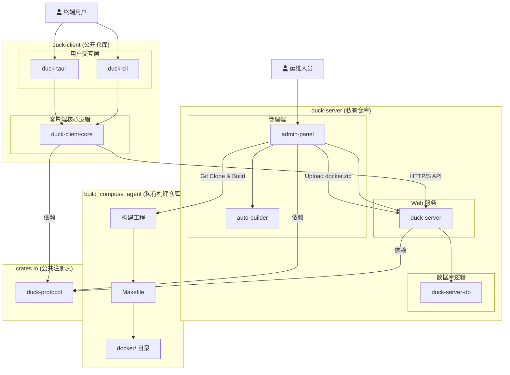

# 系统设计方案：自动化服务管理与升级
[TOC]
## 1. 概述

本方案旨在设计一个 **自动化服务管理与升级平台**，用于集中管理和维护大规模部署的、基于 Docker Compose 的服务实例。它通过一个中心化的服务端、跨平台的客户端，以及一个可视化的管理端，替代了传统的手动脚本维护模式，提供了自动化、可调度、可监控的全新运维体验。

平台包含三个核心组件：
- **服务端 (Server)**: 提供 HTTP API 服务，管理客户端注册、版本分发和遥测数据收集
- **客户端 (Client)**: 部署在各个服务节点，支持 **Tauri 桌面应用** 和 **CLI 命令行工具** 两种形态
- **管理端 (Admin Panel)**: 基于 Tauri 2.0 的可视化管理界面，用于自动化构建、发布和管理整个升级流程

平台支持 **Tauri 桌面应用** 和 **CLI 命令行工具** 两种客户端形态，满足不同用户场景下的操作需求。

## 2. 核心功能

平台的核心功能旨在实现对客户端及其托管服务的全生命周期管理。

### 2.1. 客户端功能

-   **客户端自动注册与管理**: 客户端首次启动时会自动向服务端注册，并获得唯一身份标识，便于服务端进行统一管理和追踪。
-   **服务版本检查与分发**: 服务端统一管理 Docker 服务和客户端自身的版本清单，客户端可随时查询并获取最新版本信息。
-   **一键式与预约式升级**:
    -   **一键升级**: 用户可立即触发 Docker 服务的升级流程。
    -   **预约升级**: 支持用户将升级任务安排在业务低谷时段（如凌晨）自动执行，最大化减少对业务的影响。
-   **自动化备份与恢复**: 在执行关键操作（如升级）前，系统会自动备份关键数据，确保数据安全。
-   **远程遥测与状态监控**: 客户端会向服务端上报升级历史（包括服务和客户端自身）、操作结果等遥测数据，便于中心化地监控所有节点的健康状况和版本分布。
-   **系统公告与通知**: 客户端可定时拉取服务端的最新公告消息（次要功能，后期开发）。
-   **客户端自我更新**: 采用成熟的更新机制，实现桌面客户端和CLI工具的安全、自动更新。
    参考tauri官方文档: https://tauri.org.cn/plugin/updater/#static-json-file
-   **跨平台与双模式**: 客户端支持 Windows, macOS, 和 Linux，并同时提供图形界面 (Tauri) 和命令行 (CLI) 两种交互方式。

### 2.2. 管理端功能

管理端是一个基于 **Tauri 2.0** 的桌面应用，用于简化和自动化整个构建发布流程，主要功能包括：

-   **可视化构建管理**: 提供直观的图形界面，一键触发 Docker 服务的构建流程
-   **自动化 CI/CD 流程**: 
    -   **Git 仓库监控**: 自动检测 `build_compose_agent` 工程的代码变更
    -   **自动构建**: 触发 `make dev` 命令进行项目构建
    -   **文件打包**: 自动将 `docker` 目录下的文件压缩为 `docker.zip`
    -   **版本管理**: 自动生成版本号和构建元数据
-   **发布流程管理**:
    -   **草稿上传**: 构建完成后自动上传为草稿状态
    -   **版本信息配置**: 可视化界面配置版本信息、更新日志等
    -   **审核发布**: 提供审核和发布流程，确保版本质量
-   **构建历史与监控**:
    -   **构建日志**: 实时显示构建过程和详细日志
    -   **构建历史**: 查看所有构建记录和状态
    -   **客户端状态监控**: 查看所有已注册客户端的状态和版本分布
-   **配置管理**: 
    -   **服务器配置**: 管理服务端 API 地址和认证信息
    -   **构建配置**: 管理 Git 仓库地址、分支、构建参数等
    -   **发布策略**: 配置灰度发布、强制更新等策略

## 3. 技术架构

本项目采用现代化的 Rust 技术栈，构建一个健壮、高性能且易于维护的 **三层架构**。该架构旨在实现对大规模客户端群体的集中化管理与服务分发，同时提供便捷的可视化管理工具。

-   **服务端 (Update Server)**: 作为整个平台的核心，负责客户端注册、版本管理、任务调度、数据收集和消息分发。
-   **客户端 (Client)**: 部署在每个服务节点上，负责执行来自服务端的指令（如升级、备份），上报本地状态，并为最终用户提供交互界面 (Tauri/CLI)。
-   **管理端 (Admin Panel)**: 基于 Tauri 2.0 的桌面管理应用，为开发者和运维人员提供可视化的构建、发布和监控界面。

### 3.1. 技术选型

#### 3.1.1. 服务端 (Update Server)

-   **核心框架**: `Tokio` + `Axum`
    -   **描述**: 使用 `Tokio` 作为异步运行时，`Axum` 作为 Web 框架来构建一个轻量级的 HTTP 更新服务器。
    -   **选型理由**: 高性能、高并发、安全且模块化，与 Rust 生态无缝集成。
    -   **核心职责**: 提供服务与客户端的更新清单 (`manifest.json`)、托管更新包、处理客户端注册和遥测数据上报。

#### 3.1.2. 客户端 (Desktop App & CLI)

-   **核心逻辑层 (`common` Crate)**: 为实现代码复用，所有核心业务逻辑（配置管理、Docker交互、备份、更新、数据库操作）都将抽象到一个共享的 `common` crate 中。
-   **桌面应用框架**: `Tauri`
    -   **描述**: 使用 `Tauri` 作为跨平台桌面应用的解决方案。
    -   **选型理由**: 轻量、安全、高性能，并允许使用 Rust 编写所有核心业务逻辑。
-   **前端方案**: `React`
    -   **描述**: 使用 `React` 框架构建响应式的用户界面。
-   **本地数据存储**: `SQLx` + `SQLite`
    -   **描述**: 使用 `SQLite` 作为本地数据库，通过 `SQLx` 进行异步、类型安全的数据库操作。
    -   **选型理由**: `SQLite` 轻量、无服务器，适合桌面应用；`SQLx` 提供编译时 SQL 查询检查，保证代码健壮性。
-   **客户端自我更新**:
    -   **Tauri**: 使用官方的 `tauri-plugin-updater`。
    -   **CLI**: 使用 `self-update` crate。
-   **HTTP 通信**: `reqwest`
    -   **描述**: 所有与服务端 API 的通信将使用 `reqwest` 库。我们会创建一个 `ApiClient` 包装器来统一处理 `client_id` 注入和错误处理。

#### 3.1.3. 管理端 (Admin Panel)

-   **桌面应用框架**: `Tauri 2.0`
    -   **描述**: 使用最新的 `Tauri 2.0` 框架构建管理端桌面应用。
    -   **选型理由**: 提供更好的性能、更丰富的 API 和更现代的架构。
-   **前端技术栈**: `React` + `TypeScript`
    -   **描述**: 使用 `React` 和 `TypeScript` 构建类型安全的管理界面。
    -   **UI 组件库**: 使用 `Ant Design` 或 `Material-UI` 等成熟的组件库。
-   **自动化构建核心**: 复用现有的 `auto-builder` 模块
    -   **Git 操作**: 使用 `git2` 进行仓库操作和版本管理。
    -   **构建执行**: 通过 `tokio::process::Command` 执行 `make` 命令。
    -   **文件处理**: 使用 `walkdir` 和 `zip` 进行文件打包操作。
-   **本地数据存储**: `SQLx` + `SQLite`
    -   **描述**: 存储构建历史、配置信息和任务状态。
-   **实时通信**: `WebSocket` 或 `Server-Sent Events`
    -   **描述**: 实现构建进度的实时更新和日志流传输。
-   **HTTP 通信**: `reqwest`
    -   **描述**: 与服务端 API 进行通信，上传构建产物和管理版本。

### 3.2. 客户端命令行工具 (`duck_client_cli`)

-   **参数解析**: 使用 `clap` 库解析命令行参数。
-   **核心命令**:
    -   `duck-cli check-update`: 检查服务或客户端的新版本。
    -   `duck-cli upgrade`: 执行服务升级流程。
    -   `duck-cli backup`: 手动执行一次完整的系统备份。
    -   `duck-cli list-backups`: 列出所有可用的本地备份。
    -   `duck-cli rollback <BACKUP_IDENTIFIER>`: 从指定的备份恢复系统。
    -   `duck-cli start | stop | status`: 控制和查看 Docker 服务状态。
    -   `duck-cli self-update`: 检查并更新 CLI 工具自身。

## 4. 项目结构建议

考虑到服务端代码的闭源需求以及客户端的开源计划，我们采用了三个独立工程的架构：`duck-client`（开源）、`duck-server`（私有）和 `build_compose_agent`（私有构建工程）。它们之间的通信纽带是一个独立发布到 `crates.io` 的 `duck-protocol` 共享库。

这种结构提供了最大的灵活性和最清晰的权责边界：
- **客户端** 可以独立开发、构建和发布
- **服务端** 保持私有，包含管理端桌面应用
- **构建工程** 独立维护，专注于 Docker 服务的构建

### 4.1. 模块依赖关系图

下图清晰地展示了分离后的项目依赖关系：



### 4.2. 项目与模块职责说明

-   `duck-protocol` (**公共 API 协议库**):
    -   **职责**: 定义所有客户端、管理端与服务端之间通信的数据结构（使用 `serde`）。这是一个纯数据结构库，不包含任何业务逻辑。它将被独立发布到 **`crates.io`**，供各个项目共同依赖。
    -   **代码状态**: **公开**。

-   `duck-client` (**客户端工程**):
    -   **职责**: 一个独立的 Cargo Workspace，包含所有客户端相关的代码。此项目将**在 GitHub 上开源**。
    -   **仓库地址**: https://github.com/soddygo/duck_client (dev 分支)
    -   **内部模块**:
        -   `duck-client-core`: 实现所有客户端的核心业务逻辑，如 API 通信、服务升级、备份恢复、数据库管理等。
        -   `duck-cli`: 轻量级的命令行"外壳"，负责解析参数并调用 `client-core` 中的功能。
        -   `duck-tauri`: 轻量级的图形界面"外壳"，通过 Tauri 命令调用 `client-core` 中的功能并与前端交互。

-   `duck-server` (**服务端工程**):
    -   **职责**: 一个独立的 Cargo Workspace，包含所有服务端和管理端的代码。此项目将作为**私有仓库**进行管理。
    -   **内部模块**:
        -   `duck-server`: 实现所有 API 端点的 Axum Web 服务。
        -   `duck-server-db`: 封装所有与服务端数据库的交互逻辑。
        -   `auto-builder`: 自动化构建系统，负责 Git 监控、Docker 构建和文件打包。
        -   `admin-panel`: 基于 Tauri 2.0 的管理端桌面应用，提供可视化的构建发布管理界面。

-   `build_compose_agent` (**构建工程**):
    -   **职责**: 独立的 Docker 服务构建工程，包含所有服务的 Docker Compose 配置和构建脚本。
    -   **仓库地址**: https://git.yichamao.com/agent-platform/build_compose_agent (dev 分支)
    -   **构建流程**:
        -   **初始化**: `make all` - 导出基础镜像（Redis、MySQL 等）
        -   **日常构建**: `make dev` - 快速构建，复用基础镜像
        -   **产物目录**: `docker/` - 包含所有构建产物，将被打包为 `docker.zip`
    -   **代码状态**: **私有**。

## 5. 核心流程设计

### 5.1. 客户端注册与识别

1.  **首次启动**: 客户端在首次启动时，检查本地是否存在 `client_id`。若不存在，则生成一个 UUID，收集系统信息（OS、架构），并调用服务端 `POST /api/v1/clients/register` 接口进行注册。成功后，将 `client_id` 持久化到本地 SQLite 数据库。
2.  **后续请求**: 所有对服务端的 API 请求，都在请求头中自动添加 `X-Client-ID`，用于身份识别。

### 5.2. 管理端自动化构建流程

管理端提供了完整的自动化构建和发布管理流程：

#### 5.2.1. 构建触发流程

1.  **手动触发**: 运维人员在管理端界面点击"开始构建"按钮
2.  **配置检查**: 系统检查构建配置（Git 仓库地址、分支、构建参数等）
3.  **任务创建**: 创建构建任务并加入任务队列

#### 5.2.2. 自动化构建执行

1.  **Git 操作**: 
    - 克隆或更新 `build_compose_agent` 工程到本地
    - 切换到指定分支（默认为 `dev`）
    - 检查最新提交信息
2.  **构建执行**:
    - 如果是首次构建，执行 `make all` 命令（导出基础镜像）
    - 日常构建执行 `make dev` 命令（快速构建）
    - 实时捕获和显示构建日志
3.  **产物处理**:
    - 检查 `docker/` 目录下的构建产物
    - 计算文件哈希值，生成清单信息
    - 将 `docker/` 目录压缩为 `docker.zip` 文件
4.  **版本管理**:
    - 根据 Git 提交信息自动生成版本号
    - 创建版本元数据（构建时间、提交 ID、文件大小等）

#### 5.2.3. 发布管理流程

1.  **草稿上传**: 构建完成后，系统自动将 `docker.zip` 上传到服务端存储
2.  **版本配置**: 运维人员在管理界面配置：
    - 版本信息和更新日志
    - 发布策略（全量/增量）
    - 目标客户端群体
3.  **审核发布**: 
    - 预览版本信息和影响范围
    - 确认发布，系统更新 `manifest.json`
    - 客户端即可检测到新版本

### 5.3. 更新分发机制：基于清单的差量更新

为提升更新效率，我们采用基于文件哈希比对的差量更新机制。

#### 5.3.1. 服务端流程

1.  **文件分析**: 管理端上传 `docker.zip` 后，服务端自动解压并分析文件结构
2.  **增量计算**: 与历史版本对比，计算文件差异，生成增量更新包
3.  **清单生成**: 创建包含全量和增量更新包信息的 `manifest.json`

#### 5.3.2. `manifest.json` 结构设计

```json
{
  "version": "1.2.0",
  "release_date": "2025-06-25T10:00:00Z",
  "channel": "stable",
  "notes": "### 新增功能\n- 新增了数据导出模块。",

  "packages": {
    "full": {
      "url": "http://xxxxx/1.2.0/docker.zip",
      "hash": "...",
      "size": 600000000
    },
    "incremental": {
      "url": "http://xxxx/1.2.0/incremental.zip",
      "hash": "...",
      "size": 5000000
    }
  }
}
```

### 5.4. 服务升级流程 (客户端视角)

系统的核心原则是：**检查是自动的，但升级永远是手动的、需经用户明确同意的。**

1.  **检查更新**: 客户端定期或手动从服务端获取 `manifest.json`。
2.  **决策与确认**: 客户端将服务端的清单与本地文件进行哈希比对，智能判断应采用增量或全量更新。向用户展示版本信息和更新日志，请求最终确认。
3.  **执行升级**:
    1.  **执行双重备份**:
        -   **系统备份**: 完整备份整个 `docker` 目录。
        -   **数据备份**: 单独备份 `docker/data` 目录，为数据恢复提供双重保障。
    2.  **停止服务**: 执行 `docker-compose down`。
    3.  **下载与应用更新**: 下载增量或全量包，解压并覆盖本地文件。
    4.  **加载新镜像**: 执行 `docker load -i <path-to-image.tar>`。
    5.  **启动新服务**: 执行 `docker-compose up -d`。
    6.  **健康检查与清理**: 检查服务是否成功启动，然后清理下载的临时文件。
    7.  **完成**: 通知用户升级成功，并更新本地记录的版本号。

### 5.5. 预约升级流程

1.  **用户决策**: 当检测到新版本后，UI 界面提供"立即升级"和"预约升级"选项。
2.  **任务调度**: 若用户选择预约，可指定一个未来的时间点（如次日凌晨2:00）。该任务（类型、版本、执行时间）被记录到本地 SQLite 的 `scheduled_tasks` 表中。
3.  **后台执行**: Tauri 后端的轻量级调度器会定时检查任务表。当到达指定时间，它会自动触发完整的服务升级流程。
4.  **结果反馈**: 升级结果（成功/失败及日志）被记录到数据库。用户下次打开应用时会收到通知。

### 5.6. 客户端自升级流程

1.  **检查版本**: 客户端启动时，访问服务端的客户端更新清单。
2.  **提示更新**: 若有新版本，提示用户并展示更新日志。
3.  **下载与替换**: 用户确认后，Tauri 应用使用 `tauri-plugin-updater`，CLI 工具使用 `self-update` Crate，自动完成下载、替换和重启的流程。

## 6. 管理端 UI 设计

### 6.1. 设计原则

-   **高效操作**: 界面聚焦于构建发布流程，减少不必要的步骤
-   **实时反馈**: 构建过程提供实时日志和进度显示
-   **安全可控**: 重要操作需要确认，提供回滚和撤销机制

### 6.2. 主要界面

#### 6.2.1. 构建管理页面

-   **构建触发区域**:
    - Git 仓库状态显示
    - "开始构建" 主操作按钮
    - 构建配置快速设置
-   **构建历史**:
    - 构建任务列表（状态、时间、版本）
    - 构建日志查看
    - 构建产物下载

#### 6.2.2. 发布管理页面

-   **版本管理**:
    - 草稿版本列表
    - 已发布版本历史
    - 版本对比功能
-   **发布流程**:
    - 版本信息编辑
    - 更新日志编写
    - 发布确认和审核

#### 6.2.3. 客户端监控页面

-   **客户端状态**:
    - 在线客户端列表
    - 版本分布统计
    - 升级历史查看

## 7. 客户端UI设计

为确保桌面客户端（Tauri App）简洁、直观且易于操作，我们提出以下UI设计方案。

### 7.1. 设计原则

-   **简洁至上 (Simplicity)**: 界面元素保持最简化，避免不必要的装饰和信息过载。每个页面聚焦于一个核心任务。
-   **信息清晰 (Clarity)**: 关键信息（如服务状态、版本号）一目了然。使用明确的标签、颜色和图标来传递状态。
-   **操作高效 (Efficiency)**: 将最常用的操作（如启动/停止、升级）放在最显眼的位置，减少用户点击次数。

### 7.2. 整体布局

应用采用经典的 **侧边栏导航 + 内容区** 布局。

-   **左侧导航栏**: 固定在左侧，提供对应用主要功能模块的快速访问（如：状态概览、服务管理、升级、备份历史）。
-   **右侧内容区**: 显示当前选定模块的具体内容和操作选项。

| 左侧导航栏 (固定) | 右侧内容区 (可滚动)                                      |
| ----------------- | ---------------------------------------------------------- |
| [图标] 仪表盘     | *显示当前模块的具体内容和操作选项*                         |
| [图标] 服务管理   |                                                            |
| [图标] 备份与恢复 |                                                            |
| [图标] 设置       |                                                            |
| [图标] 关于       |                                                            |

### 7.3. 核心页面设计

#### 7.3.1. 仪表盘 (Dashboard)

这是应用的默认主页，提供系统状态的概览。

- **服务状态**:
  - 一个醒目的状态指示器（例如，绿色的 "运行中" 或红色的 "已停止"）。
  - 旁边是 "启动服务" / "停止服务" 的主操作按钮。
- **版本信息**:
  - 清晰地列出 **客户端当前版本** 和 **服务当前版本**。
- **升级模块**:
  - **默认状态**: 显示 "已是最新版本"。
  - **有可用更新时**:
    - 一个醒目的通知区域出现，内容包括："发现新版本 v1.2.0"。
    - 一个主要的 **"立即升级"** 按钮。
    - 一个次要的 **"预约升级"** 按钮或链接。
    - 导航栏的"仪表盘"图标上显示一个小红点，提示用户。
- **最近活动**: (可选) 一个简短的日志列表，显示最近几次的关键操作（如 "升级成功", "备份已创建"）。

#### 7.3.2. 服务管理 (Service Management)

此页面提供对 Docker 服务的详细控制。

- **服务列表**: (如果未来有多个服务) 列出所有由 `docker-compose.yml` 管理的服务及其单独的状态。
- **操作按钮**:
  - `启动所有服务`
  - `停止所有服务`
  - `重启所有服务`
- **日志查看器**:
  - 一个实时的日志输出窗口，显示 `docker-compose logs` 的内容。
  - 提供 "清空日志" 和 "导出日志" 的功能。

#### 7.3.3. 备份与恢复 (Backup & Rollback)

管理所有的数据备份。

- **备份列表**:
  - 一个表格，列出所有已创建的备份。
  - 表格列：`备份名称/ID`、`创建时间`、`大小`、`操作`。
- **操作**:
  - 一个醒目的 **"立即创建备份"** 按钮。
  - 在备份列表的每一行，都有一个 **"从此备份恢复"** 按钮。点击后会弹出高风险操作确认框。

#### 7.3.4. 设置 (Settings)

配置应用的行为。

- **更新设置**:
  - `更新服务器URL`: 用户可以修改检查更新的服务器地址。
  - `检查更新频率`: 下拉菜单选择（如：每次启动时、每24小时、从不）。
  - 一个 **"手动检查更新"** 按钮。
- **备份设置**:
  - `备份文件存储路径`: 用户可以自定义备份文件的存放位置。

### 7.4. 关键交互流程

- **升级确认**:
  1. 用户点击"立即升级"或"预约升级"。
  2. 弹出一个模态框（Modal），清晰地展示 **当前版本** 和 **目标版本**，并附上新版本的 **更新日志 (Release Notes)**。
  3. 模态框提供"确认升级"和"取消"按钮。
  4. 用户点击"确认升级"后，界面进入"升级中"状态，显示进度条和详细的步骤日志（如：正在备份...、正在停止服务...）。
- **回滚确认**:
  1. 用户点击"从此备份恢复"。
  2. 弹出一个 **红色警告** 模态框，强调"此操作将覆盖当前所有服务文件和数据，且不可逆！"。
  3. 用户需要手动输入 "confirm" 或进行类似操作才能激活"确认回滚"按钮，防止误操作。

## 8. 扩展功能规划

### 8.1. 远程日志上报 (Remote Log Uploading)

为了在用户遇到问题时能够快速、准确地进行远程诊断，我们规划了客户端日志上报功能。

**核心原则:**

-   **用户隐私优先**: 日志上报**绝不**自动进行。每一次上报都必须由用户在客户端手动触发，并得到明确的同意。
-   **信息全面**: 上报的日志包应尽可能包含完整的上下文信息，以便于问题复现和分析。

**实现流程:**

1.  **用户触发**:
    -   在客户端的"设置"或"关于"页面，提供一个"上传诊断日志"按钮。
    -   点击按钮后，应用会向用户清晰地说明将要收集和上传哪些信息，并请求最终确认。

2.  **日志收集与打包**:
    -   确认后，客户端会收集以下信息：
        -   **应用日志**: 客户端自身运行产生的日志文件（例如，`duck_client.log`）。
        -   **服务日志**: `docker-compose` 输出的日志。
        -   **配置文件**: 脱敏后的 `config.toml` 文件。
        -   **环境快照**: 客户端版本、服务版本、操作系统、CPU架构等。
    -   所有信息将被打包成一个独立的压缩文件，例如 `diag-log-CLIENT_ID-20250624160000.zip`。

3.  **安全上传**:
    -   客户端将打包好的日志文件通过 `POST` 请求上传到服务端的一个专用接口（例如 `/api/v1/diagnostics/upload`）。
    -   服务端接收到文件后，根据 `CLIENT_ID` 进行归档存储，以待开发人员分析。

## 9. 附录：行业实践与同类方案分析

本附录旨在将我们的设计方案置于更广阔的行业背景中进行审视，以验证其合理性与先进性。

### 9.1. Tauri 桌面客户端升级方案对比

-   **行业标准**: Tauri 官方提供的 `updater` 插件是为 Tauri 应用实现自动更新的唯一官方推荐和行业标准方案。它通过中心化的更新清单 (JSON) 和数字签名机制，确保了更新流程的安全、可靠与平台无关性。
-   **本方案对齐**: 我们的设计完全采纳了此方案，确保了在客户端自我更新这一环节上，我们遵循了最安全、最成熟的最佳实践。

### 9.2. Docker 服务集中管理方案对比

对于如何管理和升级部署在大量节点上的 Docker 服务，行业内主要存在以下三类方案：

#### 1. 轻量级自动更新器 (如 Watchtower)

-   **模式**: 在每个节点上部署一个"监视器"容器，它会自动检测并拉取最新的 Docker 镜像，然后重启相关服务。
-   **优点**: 部署简单，可实现无人值守的自动化更新。
-   **缺点**: **控制力极弱**。无法实现**预约升级**、**自定义备份**、**灰度发布**和**中心化遥测**。这是一种"尽力而为"的模式，适用于对服务中断不敏感的非核心应用。

#### 2. 全功能容器管理平台 (如 Portainer, Rancher)

-   **模式**: 提供一个重量级的、通用的中心化 Web UI，用于管理一个或多个 Docker/Kubernetes 集群。
-   **优点**: 功能极其强大，提供了对底层基础设施的完全控制。
-   **缺点**: **过于复杂和笨重**。它们是为系统管理员设计的通用工具，对于只想管理**单一特定应用**的场景来说，部署和维护成本过高，功能冗余。

#### 3. 定制化的"Agent-Server"模式 (本方案采用)

-   **模式**: 在每个受管节点上安装一个轻量级代理（Agent），该代理定期与厂商的中心服务器（Server）通信，以获取指令、上报状态和接收更新。
-   **优点**: **完美平衡了自动化与控制力**，是需要向大量客户分发和管理软件的厂商中最主流的模式。它既能实现自动化，又保留了中心化的精确控制能力和状态可见性。
-   **行业实例**: 这种架构模式被广泛应用于各类成熟的企业级软件中，其健壮性和可扩展性得到了充分验证。典型案例如下：
    -   **系统更新管理**: **Microsoft WSUS** 和 **System Center (SCCM)**。客户端上的 Windows Update Agent 会与中心的 WSUS/SCCM 服务器通信，以下载经过管理员审批的系统补丁并上报合规状态。
    -   **IT 基础设施监控**: **Datadog**, **New Relic**, **Zabbix Agent**。安装在客户服务器上的 Agent 负责收集性能指标、日志和追踪数据，并将其发送回中心平台进行分析和告警。这些 Agent 本身的更新也由该机制管理。
    -   **配置管理工具**: **Puppet**, **Chef**。节点上运行的 Agent 会定期从 Master Server 拉取最新的配置清单，确保节点状态与预期一致，并上报执行结果。
    -   **终端安全软件**: **McAfee ePO**, **Symantec Endpoint Protection**。每个终端上的安全代理都会连接到中心管理服务器，以获取最新的病毒库、安全策略和软件更新。

-   **结论**: 我们的设计精准地采用了这种经过行业广泛验证的"Agent-Server"模式。相比 Watchtower，我们获得了关键的**控制力**和**可观测性**；相比 Portainer，我们的方案更**轻量、更聚焦**，完美契合我们的业务需求。


