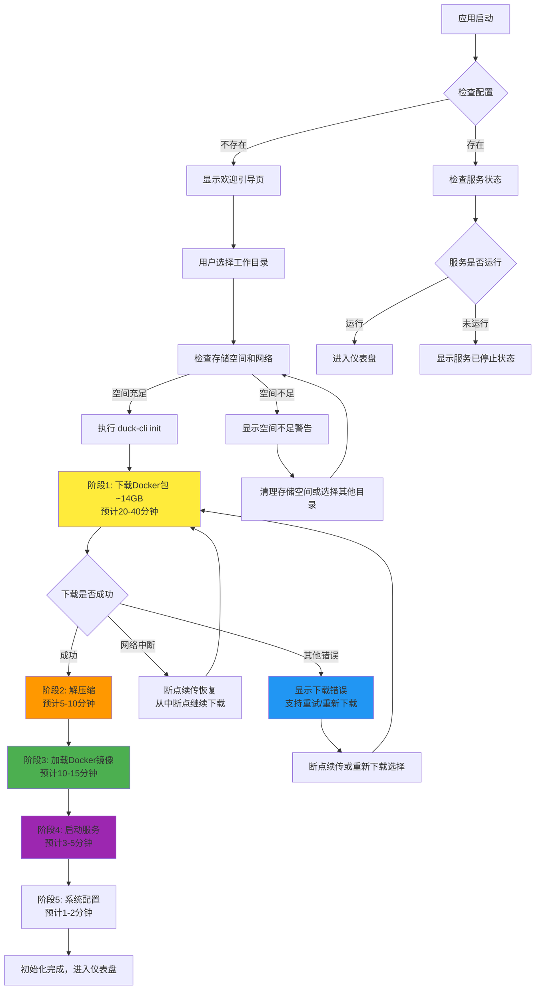
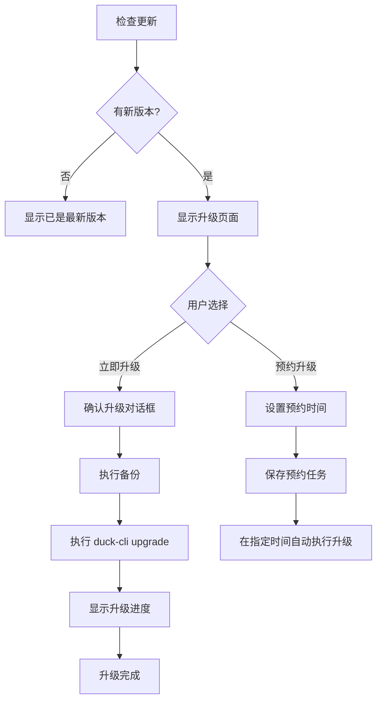
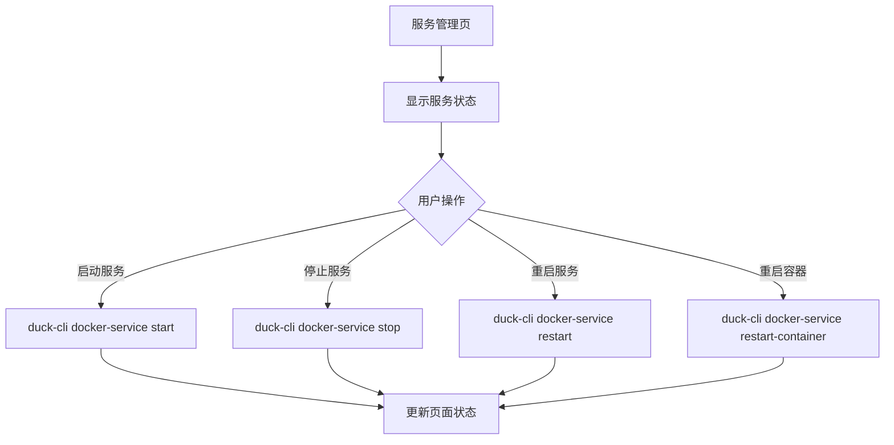

# Duck Client 桌面应用 UI 设计方案

## 1. 概述

基于现有的 `duck-cli` 命令行工具能力和服务端 API，重新设计桌面应用的用户界面。核心目标是确保 Docker 服务能够正确升级和一键部署，为用户提供简洁、高效的操作体验。

## 2. 核心用户流程

### 2.1. 首次使用流程
```
启动应用 → 欢迎引导页 → 选择工作目录 → 初始化配置 → 下载服务包 → 一键部署 → 完成设置
```

### 2.2. 日常使用流程
```
启动应用 → 仪表盘 → 检查更新 → 执行升级 → 服务管理 → 备份管理
```

## 3. 应用状态管理

### 3.1. 应用状态枚举
```typescript
enum AppState {
  UNINITIALIZED = "uninitialized",    // 未初始化
  INITIALIZING = "initializing",      // 初始化中
  DOWNLOADING = "downloading",        // 下载中
  DEPLOYING = "deploying",           // 部署中
  READY = "ready",                   // 就绪状态
  UPGRADING = "upgrading",           // 升级中
  ERROR = "error"                    // 错误状态
}
```

### 3.2. 状态检查逻辑
- 启动时检查配置文件和数据库是否存在
- 检查 Docker 服务是否已部署
- 检查服务运行状态

## 4. 页面设计

### 4.1. 欢迎引导页 (Welcome Setup)

**触发条件**: 应用状态为 `UNINITIALIZED`

**页面布局**:
```
┌─────────────────────────────────────────────────────────────┐
│                    🦆 Duck Client                            │
│                 Docker 服务管理平台                           │
│                                                             │
│  欢迎使用 Duck Client！让我们开始配置您的第一个服务吧           │
│                                                             │
│  📁 选择工作目录                                             │
│  ┌─────────────────────────────────────────┐ [浏览...]       │
│  │ /Users/username/Documents/docker-services │              │
│  └─────────────────────────────────────────┘                │
│                                                             │
│  💾 存储空间要求                                             │
│  ┌─────────────────────────────────────────┐                │
│  │ 可用空间: 128.5 GB ✅                   │                │
│  │ 所需空间: 至少 60 GB                    │                │
│  │ • Docker 服务包: ~14 GB                │                │
│  │ • 解压后文件: ~25 GB                   │                │
│  │ • 数据和日志: ~10 GB                   │                │
│  │ • 备份预留: ~15 GB                     │                │
│  └─────────────────────────────────────────┘                │
│                                                             │
│  ⏰ 时间预估                                                 │
│  • 首次部署需要 30-60 分钟                                   │
│  • 包含下载、解压、镜像加载等步骤                             │
│  • 支持断点续传，网络中断不会丢失进度                          │
│  • 可随时暂停和恢复下载                                       │
│                                                             │
│  📶 网络要求                                                 │
│  • 建议稳定的网络连接（10 Mbps 以上）                         │
│  • 支持断点续传，网络不稳定时会自动重试                        │
│  • 可在网络条件好的时候分批下载                               │
│                                                             │
│                          [开始初始化]                         │
└─────────────────────────────────────────────────────────────┘
```

**功能说明**:
- 目录选择器，支持浏览和手动输入
- 实时检查选择目录的可用空间
- 明确显示存储空间和时间要求
- 提供网络连接建议
- 点击"开始初始化"执行 `duck-cli init`

### 4.2. 初始化进度页 (Initialization Progress)

**触发条件**: 应用状态为 `INITIALIZING`, `DOWNLOADING`, `DEPLOYING`

由于 Docker 服务包体积较大（14GB-50GB+），整个初始化过程可能需要 30-60 分钟，需要提供详细的进度信息和良好的等待体验。

#### 4.2.1. 阶段一：准备和下载阶段

**页面布局**:
```
┌─────────────────────────────────────────────────────────────┐
│  🦆 Duck Client - 正在初始化服务                             │
│                                                             │
│  第 1 步 / 共 5 步：下载 Docker 服务包                       │
│                                                             │
│  ✅ 创建配置文件                                             │
│  ✅ 初始化数据库                                             │
│  ✅ 检查网络连接                                             │
│  🔄 下载服务包 (docker.zip)                                  │
│                                                             │
│  📦 服务包信息                                               │
│  • 文件大小: 14.2 GB                                        │
│  • 包含镜像: MySQL 8.0, Redis 7.0, Nginx, 业务应用等        │
│  • 预计下载时间: 25-45 分钟（根据网络速度）                   │
│                                                             │
│  🌐 下载进度                                                 │
│  ┌─────────────────────────────────────────┐                │
│  │████████████░░░░░░░░░░░░░░░░░░░░░░░░░░░░│ 32%           │
│  └─────────────────────────────────────────┘                │
│                                                             │
│  📊 已下载: 4.5 GB / 14.2 GB                                │
│  ⏱️  下载速度: 8.2 MB/s                                      │
│  ⏰ 预计剩余: 18 分钟                                         │
│                                                             │
│  ℹ️  支持断点续传，网络中断后可自动恢复。您可以最小化窗口或暂停下载│
│                                                             │
│  [💾 后台下载] [⏸️ 暂停下载] [🔄 断点续传] [❌ 取消安装]      │
└─────────────────────────────────────────────────────────────┘
```

#### 4.2.2. 阶段二：解压缩阶段

**页面布局**:
```
┌─────────────────────────────────────────────────────────────┐
│  🦆 Duck Client - 正在解压服务文件                           │
│                                                             │
│  第 2 步 / 共 5 步：解压 Docker 服务包                       │
│                                                             │
│  ✅ 下载完成 (14.2 GB)                                       │
│  🔄 解压服务文件                                             │
│                                                             │
│  📁 解压进度                                                 │
│  ┌─────────────────────────────────────────┐                │
│  │██████████████████░░░░░░░░░░░░░░░░░░░░░│ 73%           │
│  └─────────────────────────────────────────┘                │
│                                                             │
│  📊 已解压: 10.3 GB / 14.2 GB                               │
│  📂 正在解压: mysql/mysql-8.0.32.tar                         │
│  ⏰ 预计剩余: 3 分钟                                          │
│                                                             │
│  💡 解压过程中系统可能会比较繁忙，这是正常现象                 │
│                                                             │
│  详细日志 (可展开)                                           │
│  ┌─────────────────────────────────────────┐ [📄 查看日志]  │
│  │ 正在解压: images/redis-7.0.5.tar        │               │
│  │ 正在解压: images/nginx-1.24.tar         │               │
│  │ 正在解压: config/docker-compose.yml     │               │
│  └─────────────────────────────────────────┘               │
│                                                             │
│                          [❌ 取消安装]                       │
└─────────────────────────────────────────────────────────────┘
```

#### 4.2.3. 阶段三：Docker 镜像加载阶段

**页面布局**:
```
┌─────────────────────────────────────────────────────────────┐
│  🦆 Duck Client - 正在加载 Docker 镜像                       │
│                                                             │
│  第 3 步 / 共 5 步：加载 Docker 镜像到本地                    │
│                                                             │
│  ✅ 文件解压完成                                             │
│  🔄 加载 Docker 镜像                                         │
│                                                             │
│  🐳 镜像加载进度                                             │
│  ┌─────────────────────────────────────────┐                │
│  │██████████████░░░░░░░░░░░░░░░░░░░░░░░░░│ 58%           │
│  └─────────────────────────────────────────┘                │
│                                                             │
│  📦 当前加载: mysql:8.0.32 (2.1 GB)                         │
│  ✅ 已完成: redis:7.0.5, nginx:1.24                         │
│  ⏳ 待处理: app-backend, app-frontend                        │
│  ⏰ 预计剩余: 8 分钟                                          │
│                                                             │
│  💡 首次加载镜像需要较长时间，后续启动会很快                   │
│                                                             │
│  镜像加载详情                                                │
│  ┌─────────────────────────────────────────┐                │
│  │ ✅ redis:7.0.5          (245 MB)       │                │
│  │ ✅ nginx:1.24           (187 MB)       │                │
│  │ 🔄 mysql:8.0.32         (2.1 GB)       │                │
│  │ ⏳ app-backend:latest    (1.8 GB)       │                │
│  │ ⏳ app-frontend:latest   (680 MB)       │                │
│  └─────────────────────────────────────────┘                │
│                                                             │
│                          [❌ 取消安装]                       │
└─────────────────────────────────────────────────────────────┘
```

#### 4.2.4. 阶段四：服务启动阶段

**页面布局**:
```
┌─────────────────────────────────────────────────────────────┐
│  🦆 Duck Client - 正在启动 Docker 服务                       │
│                                                             │
│  第 4 步 / 共 5 步：启动和配置 Docker 服务                    │
│                                                             │
│  ✅ 镜像加载完成                                             │
│  🔄 启动 Docker 服务                                         │
│                                                             │
│  🚀 服务启动进度                                             │
│  ┌─────────────────────────────────────────┐                │
│  │███████████████████████░░░░░░░░░░░░░░░░│ 85%           │
│  └─────────────────────────────────────────┘                │
│                                                             │
│  服务启动状态                                                │
│  ┌─────────────────────────────────────────┐                │
│  │ ✅ mysql-db      已启动 (端口: 3306)     │                │
│  │ ✅ redis-cache   已启动 (端口: 6379)     │                │
│  │ ✅ nginx-proxy   已启动 (端口: 80,443)   │                │
│  │ 🔄 app-backend   启动中... (端口: 8080)  │                │
│  │ ⏳ app-frontend  等待启动 (端口: 3000)   │                │
│  └─────────────────────────────────────────┘                │
│                                                             │
│  🔍 健康检查                                                 │
│  • 正在等待 app-backend 服务就绪...                          │
│  • 预计剩余时间: 2 分钟                                       │
│                                                             │
│  💡 首次启动需要初始化数据库，请耐心等待                       │
│                                                             │
│                          [❌ 取消安装]                       │
└─────────────────────────────────────────────────────────────┘
```

#### 4.2.5. 阶段五：完成配置

**页面布局**:
```
┌─────────────────────────────────────────────────────────────┐
│  🦆 Duck Client - 完成初始化                                 │
│                                                             │
│  第 5 步 / 共 5 步：完成系统配置                              │
│                                                             │
│  ✅ 所有服务启动成功                                         │
│  🔄 执行系统配置                                             │
│                                                             │
│  🔧 配置进度                                                 │
│  ┌─────────────────────────────────────────┐                │
│  │████████████████████████████████████████│ 100%          │
│  └─────────────────────────────────────────┘                │
│                                                             │
│  配置完成项目                                                │
│  ┌─────────────────────────────────────────┐                │
│  │ ✅ 数据库初始化完成                      │                │
│  │ ✅ 服务端口配置完成                      │                │
│  │ ✅ 网络配置完成                          │                │
│  │ ✅ 安全策略配置完成                      │                │
│  │ ✅ 监控配置完成                          │                │
│  └─────────────────────────────────────────┘                │
│                                                             │
│  🎉 恭喜！Duck Client 初始化完成                             │
│                                                             │
│  📊 服务统计                                                 │
│  • 总计用时: 42 分钟                                         │
│  • 下载大小: 14.2 GB                                        │
│  • 运行容器: 5 个                                            │
│  • 服务地址: http://localhost                                │
│                                                             │
│                      [🚀 进入控制台]                         │
└─────────────────────────────────────────────────────────────┘
```

### 4.2.6. 后台下载模式

当用户选择"后台下载"时：

**最小化状态栏显示**:
```
┌─────────────────────────────────────────┐
│ 🦆 Duck Client - 后台下载中              │
│ ████████░░░░░░░░░░ 32% | 8.2MB/s | 18分钟 │
│ 🔄 断点续传已启用 | 分片: 23/70          │
│ [📋 查看详情] [⏸️ 暂停] [❌ 取消]         │
└─────────────────────────────────────────┘
```

**功能说明**:
- 分阶段显示详细进度，让用户清楚了解当前进行的步骤
- 提供准确的时间估算和进度百分比
- 显示当前正在处理的具体文件或镜像
- 支持后台下载模式，用户可以最小化窗口
- 提供详细日志查看功能
- 在关键阶段提供用户友好的说明和建议
- **断点续传支持**: 网络中断时自动保存进度，恢复后从断点继续
- **智能重试机制**: 网络错误时自动重试，无需用户干预
- **分片下载优化**: 多线程下载提升速度，单个分片失败不影响整体
- 支持暂停/恢复下载功能
- 显示完整的统计信息和分片详情

### 4.3. 主界面 - 仪表盘 (Dashboard)

**触发条件**: 应用状态为 `READY`

**整体布局**:
```
┌─────────────────────────────────────────────────────────────┐
│ 🦆 Duck Client                                    [🔔] [⚙️] │
├─────────┬───────────────────────────────────────────────────┤
│ 📊 仪表盘 │                    系统状态                        │
│ 🐳 服务管理│                                                   │
│ 📦 升级管理│  ┌─────────────────┐  ┌─────────────────┐         │
│ 💾 备份恢复│  │   服务状态      │  │   版本信息      │         │
│ ⚙️ 系统设置│  │  🟢 运行中       │  │  客户端: v1.2.0  │         │
│ ℹ️ 关于   │  │  5个容器         │  │  服务: v2.1.5    │         │
│          │  │  运行时间: 2天    │  │                 │         │
│          │  └─────────────────┘  └─────────────────┘         │
│          │                                                   │
│          │                    快速操作                        │
│          │  ┌─────────────────────────────────────────────┐   │
│          │  │ [🚀 启动服务] [⏹️ 停止服务] [🔄 重启服务]      │   │
│          │  └─────────────────────────────────────────────┘   │
│          │                                                   │
│          │                    升级通知                        │
│          │  ┌─────────────────────────────────────────────┐   │
│          │  │ 🆕 发现新版本 v2.2.0                        │   │
│          │  │    • 新增自动备份功能                        │   │
│          │  │    • 修复启动速度问题                        │   │
│          │  │    [立即升级] [预约升级] [查看详情]           │   │
│          │  └─────────────────────────────────────────────┘   │
└─────────┴───────────────────────────────────────────────────┘
```

### 4.4. 服务管理页 (Service Management)

**页面布局**:
```
┌─────────────────────────────────────────────────────────────┐
│                       Docker 服务管理                        │
│                                                             │
│  当前服务状态: 🟢 运行中                                      │
│  ┌─────────────────────────────────────────────────────────┐ │
│  │ [🚀 启动所有服务] [⏹️ 停止所有服务] [🔄 重启所有服务]      │ │
│  └─────────────────────────────────────────────────────────┘ │
│                                                             │
│  服务详情                                                    │
│  ┌─────────────────────────────────────────────────────────┐ │
│  │ 容器名称         │ 状态    │ 端口映射    │ 操作          │ │
│  ├─────────────────────────────────────────────────────────┤ │
│  │ app-frontend     │ 🟢 运行 │ 80:3000    │ [重启] [日志] │ │
│  │ app-backend      │ 🟢 运行 │ 8080:8080  │ [重启] [日志] │ │
│  │ mysql-db         │ 🟢 运行 │ 3306:3306  │ [重启] [日志] │ │
│  │ redis-cache      │ 🟢 运行 │ 6379:6379  │ [重启] [日志] │ │
│  │ nginx-proxy      │ 🟢 运行 │ 443:443    │ [重启] [日志] │ │
│  └─────────────────────────────────────────────────────────┘ │
│                                                             │
│  系统信息                                                    │
│  • 工作目录: /Users/username/Documents/docker-services        │
│  • 数据目录: ./docker/data                                   │
│  • 配置文件: config.toml                                     │
│                                                             │
│  [🐋 使用 Ducker 管理] [📂 打开工作目录] [📋 查看日志]         │
└─────────────────────────────────────────────────────────────┘
```

### 4.5. 升级管理页 (Upgrade Management)

**页面布局**:
```
┌─────────────────────────────────────────────────────────────┐
│                         升级管理                             │
│                                                             │
│  版本信息                                                    │
│  ┌─────────────────┐  ┌─────────────────┐                   │
│  │  当前版本       │  │  最新版本       │                   │
│  │   v2.1.5       │  │   v2.2.0       │                   │
│  │  📅 2024-01-15  │  │  📅 2024-01-20  │                   │
│  └─────────────────┘  └─────────────────┘                   │
│                                                             │
│  🆕 更新内容 (v2.2.0)                                        │
│  ┌─────────────────────────────────────────────────────────┐ │
│  │ ### 新增功能                                            │ │
│  │ - 🚀 新增自动备份调度功能                               │ │
│  │ - 📊 增强的性能监控面板                                │ │
│  │ - 🔒 改进的安全认证机制                                │ │
│  │                                                         │ │
│  │ ### 优化改进                                            │ │
│  │ - ⚡ 提升启动速度 50%                                   │ │
│  │ - 🐛 修复已知问题 15 项                                │ │
│  │ - 🔧 减少内存占用 20%                                  │ │
│  │                                                         │ │
│  │ ### 注意事项                                            │ │
│  │ - 📦 本次需要重新启动所有服务                           │ │
│  │ - 💾 建议在业务低峰期进行升级                           │ │
│  └─────────────────────────────────────────────────────────┘ │
│                                                             │
│  升级选项                                                    │
│  ┌─────────────────────────────────────────────────────────┐ │
│  │ 🔄 [立即升级] - 现在开始升级过程                        │ │
│  │ ⏰ [预约升级] - 安排在指定时间自动升级                   │ │
│  │ 📋 [检查更新] - 重新检查是否有新版本                    │ │
│  └─────────────────────────────────────────────────────────┘ │
└─────────────────────────────────────────────────────────────┘
```

### 4.6. 备份恢复页 (Backup & Recovery)

**页面布局**:
```
┌─────────────────────────────────────────────────────────────┐
│                        备份与恢复                            │
│                                                             │
│  备份概览                                                    │
│  ┌─────────────────┐ ┌─────────────────┐ ┌─────────────────┐ │
│  │   备份数量      │ │   总点用空间     │ │   最近备份      │ │
│  │      3         │ │    289.7 MB    │ │  2024-01-20    │ │
│  │   📂 2个       │ │   💾 已启用     │ │   10:30        │ │
│  └─────────────────┘ └─────────────────┘ └─────────────────┘ │
│                                                             │
│  ┌─────────────────────────────────────────────────────────┐ │
│  │ [💾 立即备份] [⚙️ 自动备份设置] [🔄 刷新列表]           │ │
│  └─────────────────────────────────────────────────────────┘ │
│                                                             │
│  备份列表                                                    │
│  ┌─────────────────────────────────────────────────────────┐ │
│  │ 备份名称                │ 创建时间    │ 文件大小 │ 状态 │操作│ │
│  ├─────────────────────────────────────────────────────────┤ │
│  │ backup_20240120_103000  │ 2024-01-20 │ 150 MB  │ ✅正常│恢复│ │
│  │                         │ 10:30:00   │         │      │删除│ │
│  ├─────────────────────────────────────────────────────────┤ │
│  │ backup_20240119_020000  │ 2024-01-19 │ 139 MB  │ ✅正常│恢复│ │
│  │                         │ 02:00:00   │         │      │删除│ │
│  └─────────────────────────────────────────────────────────┘ │
│                                                             │
│  自动备份设置                                                │
│  ┌─────────────────────────────────────────────────────────┐ │
│  │ ☑️ 启用自动备份                                         │ │
│  │ ⏰ 备份时间: 每天 02:00                                  │ │
│  │ 📦 保留数量: 最多保留 7 个备份                           │ │
│  │ 📁 备份路径: ./backups                                  │ │
│  └─────────────────────────────────────────────────────────┘ │
└─────────────────────────────────────────────────────────────┘
```

### 4.7. 系统设置页 (Settings)

**页面布局**:
```
┌─────────────────────────────────────────────────────────────┐
│                         系统设置                             │
│                                                             │
│  📁 数据目录  ☑️ 已初始化                                     │
│  ┌─────────────────────────────────────────────────────────┐ │
│  │ 工作目录: /Users/username/Downloads/testdeploy           │ │
│  │                                                         │ │
│  │ 基于 duck-cli init 执行目录，包含所有 Docker 服务、备份、 │ │
│  │ 缓存数据                                                │ │
│  │                                                         │ │
│  │ [🔄 更换工作目录] [📂 打开工作目录] [🧹 清理缓存]        │ │
│  └─────────────────────────────────────────────────────────┘ │
│                                                             │
│  🌐 API配置  ☑️ 已连接                                       │
│  ┌─────────────────────────────────────────────────────────┐ │
│  │ 服务器地址: https://api.duck-client.dev                  │ │
│  │ API版本: v1                                             │ │
│  │ 客户端ID: 018f2fa7-6b61-7b25-844a-3e7584b2bf9c         │ │
│  │                                                         │ │
│  │ [🔧 编辑配置] [🔍 测试连接] [📋 查看API信息]             │ │
│  └─────────────────────────────────────────────────────────┘ │
│                                                             │
│  📊 总点用空间                                               │
│  ┌─────────────────────────────────────────────────────────┐ │
│  │ 备份目录   ./backups      289.07 MB  [打开备份目录]      │ │
│  │ 缓存目录   ./cache/data   659.0 MB   [打开缓存目录]      │ │
│  │ Docker目录 ./docker       895.0 MB   [打开Docker目录]    │ │
│  │                                                         │ │
│  │ 总计用量: 0.01 MB                                       │ │
│  └─────────────────────────────────────────────────────────┘ │
│                                                             │
│  🔧 操作                                                     │
│  ┌─────────────────────────────────────────────────────────┐ │
│  │ [🗑️ 清理缓存存储] [📤 自动备份服务] [🔄 刷新信息]        │ │
│  └─────────────────────────────────────────────────────────┘ │
└─────────────────────────────────────────────────────────────┘
```

## 5. 交互流程设计

### 5.1. 首次初始化流程



### 5.2. 升级流程



### 5.3. 服务管理流程



## 6. 错误处理和用户反馈

### 6.1. 错误状态设计

#### 6.1.1. 网络相关错误

**下载中断错误页面**:
```
┌─────────────────────────────────────────────────────────────┐
│  ⚠️ 下载中断                                                 │
│                                                             │
│  📦 下载进度: 6.8 GB / 14.2 GB (已完成 48%)                  │
│  🔌 检测到网络连接中断                                       │
│                                                             │
│  📡 服务器能力: ✅ 支持断点续传 (阿里云 OSS)                  │
│                                                             │
│  🔄 恢复选项:                                                │
│  ┌─────────────────────────────────────────┐                │
│  │ [🚀 立即续传] - 从 6.8GB 断点继续下载     │                │
│  │ [⏰ 延迟续传] - 等待网络稳定后自动续传    │                │
│  │ [🔄 重新下载] - 删除已下载文件重新开始    │                │
│  │ [❌ 取消安装] - 退出初始化流程           │                │
│  └─────────────────────────────────────────┘                │
│                                                             │
│  💡 提示: 支持断点续传，已下载的 6.8GB 数据不会丢失           │
│                                                             │
│  📋 续传优势:                                                │
│  • 节省时间: 只需下载剩余 7.4GB                              │
│  • 节省流量: 避免重复下载已完成部分                           │
│  • 智能重试: 网络恢复后自动继续下载                           │
│                                                             │
│  🔍 下载详情:                                                │
│  • 已完成分片: 1-34 (共 70 个分片)                           │
│  • 待下载分片: 35-70                                         │
│  • 预计剩余时间: 15-25 分钟                                  │
└─────────────────────────────────────────────────────────────┘
```

#### 6.1.2. 存储空间相关错误

**空间不足错误页面**:
```
┌─────────────────────────────────────────────────────────────┐
│  ⚠️ 存储空间不足                                             │
│                                                             │
│  📊 空间使用情况:                                            │
│  ┌─────────────────────────────────────────┐                │
│  │ 总空间:     256 GB                     │                │
│  │ 已使用:     220 GB                     │                │
│  │ 可用空间:   36 GB ❌                   │                │
│  │ 所需空间:   60 GB                      │                │
│  │ 缺少空间:   24 GB                      │                │
│  └─────────────────────────────────────────┘                │
│                                                             │
│  🛠️ 解决方案:                                                │
│  ┌─────────────────────────────────────────┐                │
│  │ [🧹 清理磁盘] - 释放系统垃圾文件         │                │
│  │ [📁 选择其他目录] - 使用其他存储位置     │                │
│  │ [💾 外接存储] - 使用外接硬盘           │                │
│  │ [❌ 取消安装] - 退出初始化             │                │
│  └─────────────────────────────────────────┘                │
│                                                             │
│  💡 建议: 保留额外 20GB 空间用于后续更新和备份                 │
└─────────────────────────────────────────────────────────────┘
```

#### 6.1.3. Docker 相关错误

**Docker 服务异常页面**:
```
┌─────────────────────────────────────────────────────────────┐
│  ⚠️ Docker 服务异常                                          │
│                                                             │
│  🐳 错误详情:                                                │
│  ┌─────────────────────────────────────────┐                │
│  │ 错误类型: Docker Daemon 未运行          │                │
│  │ 错误代码: DOCKER_NOT_RUNNING            │                │
│  │ 发生时间: 2024-01-20 15:30:25           │                │
│  └─────────────────────────────────────────┘                │
│                                                             │
│  🔧 自动修复:                                                │
│  ┌─────────────────────────────────────────┐                │
│  │ [🚀 启动 Docker] - 尝试启动 Docker 服务  │                │
│  │ [🔄 重新检测] - 重新检查 Docker 状态     │                │
│  │ [📋 查看日志] - 查看详细错误日志         │                │
│  │ [❓ 获取帮助] - 查看解决方案            │                │
│  └─────────────────────────────────────────┘                │
│                                                             │
│  📖 常见解决方案:                                            │
│  • 确保 Docker Desktop 已安装并运行                          │
│  • 检查系统资源是否充足                                       │
│  • 重启 Docker 服务                                         │
└─────────────────────────────────────────────────────────────┘
```

### 6.2. 进度反馈增强

#### 6.2.1. 智能时间预估

- **动态调整**: 根据实际下载速度动态调整预计时间
- **历史数据**: 基于历史下载记录优化时间预估
- **多级预估**: 提供最快、平均、最慢三种时间预估

#### 6.2.2. 详细进度信息

- **实时速度**: 显示当前下载/处理速度
- **剩余时间**: 动态计算并显示预计剩余时间
- **步骤进度**: 每个主要步骤的独立进度条
- **资源使用**: 显示 CPU、内存、磁盘使用情况

#### 6.2.3. 用户友好提示

- **阶段说明**: 清楚说明当前正在进行的操作
- **等待建议**: 在长时间操作时提供建议（如可以最小化窗口）
- **完成通知**: 操作完成时的桌面通知
- **错误恢复**: 自动重试机制和手动恢复选项

## 7. 响应式设计

### 7.1. 最小窗口尺寸
- 宽度: 800px
- 高度: 600px

### 7.2. 自适应布局
- 侧边栏可收起
- 内容区域自动调整
- 重要操作按钮始终可见

## 8. 性能优化

### 8.1. 数据刷新策略
- 服务状态每 30 秒刷新一次
- 升级检查每小时执行一次
- 手动刷新立即更新

### 8.2. 异步操作
- 所有 CLI 命令异步执行
- 进度实时更新
- 支持操作取消

## 9. CLI 命令映射和能力扩展

### 9.1. 现有 CLI 命令映射

| UI 操作 | 现有 CLI 命令 | 状态 | 说明 |
|---------|---------------|------|------|
| 初始化配置 | `duck-cli init` | ✅ 可用 | 创建配置文件和数据库 |
| 一键部署 | `duck-cli auto-upgrade-deploy run` | ✅ 可用 | 下载并部署服务 |
| 检查更新 | `duck-cli check-update check` | ✅ 可用 | 检查客户端和服务更新 |
| 升级服务 | `duck-cli upgrade` | ✅ 可用 | 下载并升级服务 |
| 启动服务 | `duck-cli docker-service start` | ✅ 可用 | 启动所有Docker服务 |
| 停止服务 | `duck-cli docker-service stop` | ✅ 可用 | 停止所有Docker服务 |
| 重启服务 | `duck-cli docker-service restart` | ✅ 可用 | 重启所有Docker服务 |
| 服务状态 | `duck-cli docker-service status` | ✅ 可用 | 查看服务状态 |
| 重启容器 | `duck-cli docker-service restart-container <name>` | ✅ 可用 | 重启指定容器 |
| 创建备份 | `duck-cli backup` | ✅ 可用 | 手动创建备份 |
| 列出备份 | `duck-cli list-backups` | ✅ 可用 | 显示所有备份 |
| 恢复备份 | `duck-cli rollback <backup_id>` | ✅ 可用 | 从备份恢复 |
| 缓存管理 | `duck-cli cache clear` | ✅ 可用 | 清理缓存 |
| 启动Ducker | `duck-cli ducker` | ✅ 可用 | 启动Ducker容器管理工具 |

### 9.2. 需要新增的 UI 支持函数

| UI 功能 | 需要新增的函数 | 位置 | 说明 |
|---------|----------------|------|------|
| 带进度的初始化 | `init_with_progress()` | `duck-cli/src/ui_support.rs` | 支持进度回调的初始化 |
| 带进度的下载 | `download_with_progress()` | `duck-cli/src/ui_support.rs` | 支持进度回调和断点续传的下载 |
| 实时服务监控 | `monitor_services()` | `duck-cli/src/ui_support.rs` | 返回服务状态流 |
| 系统信息检查 | `get_system_info()` | `duck-cli/src/ui_support.rs` | 跨平台系统信息 |
| 存储空间检查 | `check_storage_space()` | `duck-cli/src/ui_support.rs` | 检查可用空间 |
| Docker 状态检查 | `check_docker_status()` | `duck-cli/src/ui_support.rs` | 检查 Docker 运行状态 |
| 平台特定路径 | `get_default_paths()` | `duck-cli/src/ui_support.rs` | 获取平台默认路径 |
| 任务取消支持 | `cancel_task()` | `duck-cli/src/ui_support.rs` | 取消长时间运行任务 |
| 断点续传检查 | `check_resume_capability()` | `duck-cli/src/ui_support.rs` | 检查已下载文件和续传能力 |
| 分片下载状态 | `get_download_chunks_status()` | `duck-cli/src/ui_support.rs` | 获取分片下载详细状态 |

### 9.3. lib.rs 暴露接口设计

```rust
// duck-cli/src/lib.rs
pub mod ui_support;

// 重新导出核心功能
pub use client_core::{
    config::ConfigManager,
    backup::BackupManager,
    container::ServiceManager,
    database::DatabaseManager,
    api::ApiClient,
};

// 导出 UI 支持函数
pub use ui_support::{
    init_with_progress,
    download_with_progress,
    monitor_services,
    get_system_info,
    check_storage_space,
    check_docker_status,
    get_default_paths,
    cancel_task,
    check_resume_capability,
    get_download_chunks_status,
};

// 导出类型定义
pub use types::{
    DownloadProgress,
    SystemInfo,
    ServiceStatus,
    Platform,
    StorageInfo,
    DownloadChunk,
    ResumeInfo,
};
```

## 10. 跨平台构建和发布

### 10.1. GitHub Actions 构建流程

**基于现有 release.yml 的扩展**:
```yaml
# .github/workflows/release.yml (扩展)
jobs:
  build-tauri:
    name: Build Tauri App for ${{ matrix.platform.name }}
    runs-on: ${{ matrix.platform.os }}
    strategy:
      matrix:
        platform:
          - name: Windows-x86_64
            os: windows-latest
            target: x86_64-pc-windows-msvc
            
          - name: Windows-aarch64  
            os: windows-latest
            target: aarch64-pc-windows-msvc
            
          - name: macOS-x86_64
            os: macos-latest
            target: x86_64-apple-darwin
            
          - name: macOS-aarch64
            os: macos-latest
            target: aarch64-apple-darwin
            
          - name: Linux-x86_64
            os: ubuntu-latest
            target: x86_64-unknown-linux-gnu
            
          - name: Linux-aarch64
            os: ubuntu-latest
            target: aarch64-unknown-linux-gnu
    
    steps:
      - name: Install Deno
        uses: denoland/setup-deno@v1
        with:
          deno-version: v1.x
          
      - name: Install Tauri dependencies (Ubuntu)
        if: matrix.platform.os == 'ubuntu-latest'
        run: |
          sudo apt-get update
          sudo apt-get install -y libgtk-3-dev libwebkit2gtk-4.0-dev librsvg2-dev
          
      - name: Build Tauri App
        run: |
          cd client-ui
          deno task tauri build --target ${{ matrix.platform.target }}
```

### 10.2. 平台特定注意事项

#### 10.2.1. Windows 平台
```rust
// 平台特定实现
#[cfg(target_os = "windows")]
mod windows_specific {
    use std::os::windows::process::CommandExt;
    
    pub fn get_default_docker_path() -> Option<PathBuf> {
        // Windows 下 Docker Desktop 的默认路径
        let program_files = std::env::var("ProgramFiles").ok()?;
        Some(PathBuf::from(program_files).join("Docker\\Docker\\Docker Desktop.exe"))
    }
    
    pub fn check_wsl_status() -> bool {
        // 检查 WSL 状态，Windows 下 Docker 可能需要 WSL
        Command::new("wsl")
            .arg("--status")
            .creation_flags(0x08000000) // CREATE_NO_WINDOW
            .output()
            .map(|output| output.status.success())
            .unwrap_or(false)
    }
}
```

#### 10.2.2. macOS 平台
```rust
#[cfg(target_os = "macos")]
mod macos_specific {
    pub fn get_default_docker_path() -> Option<PathBuf> {
        // macOS 下 Docker Desktop 的默认路径
        Some(PathBuf::from("/Applications/Docker.app"))
    }
    
    pub fn check_homebrew_docker() -> bool {
        // 检查是否通过 Homebrew 安装了 Docker
        Command::new("brew")
            .args(&["list", "docker"])
            .output()
            .map(|output| output.status.success())
            .unwrap_or(false)
    }
}
```

#### 10.2.3. Linux 平台
```rust
#[cfg(target_os = "linux")]
mod linux_specific {
    pub fn get_docker_service_status() -> DockerServiceStatus {
        // 检查 systemd 服务状态
        let systemctl_status = Command::new("systemctl")
            .args(&["is-active", "docker"])
            .output();
            
        match systemctl_status {
            Ok(output) if output.status.success() => DockerServiceStatus::Running,
            _ => DockerServiceStatus::Stopped,
        }
    }
    
    pub fn check_docker_group_membership() -> bool {
        // 检查当前用户是否在 docker 组中
        Command::new("groups")
            .output()
            .map(|output| {
                String::from_utf8_lossy(&output.stdout)
                    .contains("docker")
            })
            .unwrap_or(false)
    }
}
```

### 10.3. 跨平台UI适配

#### 10.3.1. 平台特定的存储路径建议
```typescript
// components/WelcomeSetup.tsx
export function WelcomeSetup() {
  const [platform, setPlatform] = useState<Platform>('linux');
  const [suggestedPath, setSuggestedPath] = useState<string>('');
  
  useEffect(() => {
    async function initPlatform() {
      const currentPlatform = await getCurrentPlatform();
      setPlatform(currentPlatform);
      setSuggestedPath(getStoragePathSuggestion(currentPlatform));
    }
    initPlatform();
  }, []);
  
  const platformSpecificTips = {
    windows: [
      '• 建议选择非系统盘(如D盘)以获得更好性能',
      '• 确保 Windows Defender 已将工作目录添加到排除列表',
      '• 如使用 WSL，请确保 WSL2 已启用'
    ],
    macos: [
      '• 避免选择 iCloud Drive 同步的目录',
      '• 建议使用 Documents 或专门的开发目录',
      '• 确保 Docker Desktop 已安装并运行'
    ],
    linux: [
      '• 确保有足够的磁盘空间和 inodes',
      '• 检查目录权限，避免需要 sudo 的路径',
      '• 确保当前用户在 docker 组中'
    ]
  };
  
  return (
    <div className="welcome-setup">
      <h2>选择工作目录</h2>
      <input 
        value={workingDir || suggestedPath}
        placeholder={`推荐路径: ${suggestedPath}`}
      />
      
      <div className="platform-tips">
        <h3>{platform.charAt(0).toUpperCase() + platform.slice(1)} 平台提示:</h3>
        <ul>
          {platformSpecificTips[platform].map((tip, index) => (
            <li key={index}>{tip}</li>
          ))}
        </ul>
      </div>
    </div>
  );
}
```

### 10.4. 错误处理的平台差异

```rust
// duck-cli/src/ui_support.rs
pub fn get_platform_specific_error_help(error: &str) -> Vec<String> {
    let mut suggestions = vec![];
    
    #[cfg(target_os = "windows")]
    {
        if error.contains("docker") {
            suggestions.push("检查 Docker Desktop 是否已启动".to_string());
            suggestions.push("确认 WSL2 已正确配置".to_string());
            suggestions.push("以管理员身份运行可能解决权限问题".to_string());
        }
    }
    
    #[cfg(target_os = "macos")]
    {
        if error.contains("permission denied") {
            suggestions.push("尝试使用 sudo 命令".to_string());
            suggestions.push("检查系统完整性保护设置".to_string());
        }
    }
    
    #[cfg(target_os = "linux")]
    {
        if error.contains("docker") {
            suggestions.push("检查 Docker 服务状态: systemctl status docker".to_string());
            suggestions.push("确认用户在 docker 组中: sudo usermod -aG docker $USER".to_string());
            suggestions.push("重启 Docker 服务: sudo systemctl restart docker".to_string());
        }
    }
    
    suggestions
}
```

## 11. 实现优先级

### 阶段一 (核心功能)
1. ✅ 应用状态检查和初始化流程
2. ✅ 欢迎引导页和工作目录选择
3. ✅ 初始化进度页面
4. ✅ 基础仪表盘

### 阶段二 (服务管理)
1. 🔄 服务管理页面
2. 🔄 Docker服务状态监控
3. 🔄 服务启停控制

### 阶段三 (升级功能)
1. ⏳ 升级检查和通知
2. ⏳ 升级管理页面
3. ⏳ 预约升级功能

### 阶段四 (备份和设置)
1. ⏳ 备份恢复页面
2. ⏳ 系统设置页面
3. ⏳ 错误处理和日志查看

### 阶段五 (优化和完善)
1. ⏳ 性能优化
2. ⏳ 用户体验优化
3. ⏳ 测试和调试功能

## 11. 技术实现要点

### 11.1. CLI 能力扩展和 Tauri 封装

#### 11.1.1. CLI 核心逻辑扩展

**在 duck-cli 中新增 UI 支持函数**:
```rust
// duck-cli/src/ui_support.rs
pub mod ui_support {
    use client_core::*;
    
    // 为 UI 提供的带进度回调的下载函数
    pub async fn download_with_progress<F>(
        url: &str,
        target_dir: &Path,
        progress_callback: F,
    ) -> Result<(), Box<dyn std::error::Error>>
    where
        F: Fn(DownloadProgress) + Send + Sync + 'static,
    {
        // 复用 client-core 的下载逻辑
        // 添加进度回调支持
    }
    
    // 获取系统信息（跨平台）
    pub fn get_system_info() -> SystemInfo {
        SystemInfo {
            os: std::env::consts::OS,
            arch: std::env::consts::ARCH,
            available_space: get_available_space(),
            docker_status: check_docker_status(),
        }
    }
    
    // 实时服务状态监控
    pub async fn monitor_services() -> impl Stream<Item = ServiceStatus> {
        // 返回服务状态流
    }
}
```

**通过 lib.rs 暴露给 Tauri**:
```rust
// duck-cli/src/lib.rs
pub mod ui_support;
pub use ui_support::*;

// 重新导出 client-core 的核心功能
pub use client_core::{
    config::ConfigManager,
    backup::BackupManager,
    container::ServiceManager,
    // ... 其他核心模块
};
```

#### 11.1.2. Tauri 命令封装

```rust
// client-ui/src-tauri/src/commands.rs
use duck_cli::ui_support::*;
use tauri::{AppHandle, Manager};

#[tauri::command]
async fn init_client_with_progress(
    app_handle: AppHandle,
    working_dir: String,
) -> Result<String, String> {
    let (tx, mut rx) = tokio::sync::mpsc::unbounded_channel();
    
    // 启动初始化任务
    tokio::spawn(async move {
        duck_cli::ui_support::init_with_progress(&working_dir, |progress| {
            let _ = tx.send(progress);
        }).await
    });
    
    // 转发进度事件到前端
    tokio::spawn(async move {
        while let Some(progress) = rx.recv().await {
            let _ = app_handle.emit_all("init-progress", progress);
        }
    });
    
    Ok("初始化已启动".to_string())
}

// 跨平台的系统检查
#[tauri::command]
async fn check_system_requirements() -> Result<SystemRequirements, String> {
    let info = duck_cli::ui_support::get_system_info();
    
    Ok(SystemRequirements {
        os_supported: check_os_support(&info.os),
        docker_available: info.docker_status.is_running,
        storage_sufficient: info.available_space > REQUIRED_SPACE,
        // 平台特定检查
        platform_specific: check_platform_requirements(&info),
    })
}
```

### 11.2. 大文件下载优化
```rust
// 示例：大文件下载的 Tauri 命令实现
#[tauri::command]
async fn download_docker_package(
    app_handle: tauri::AppHandle,
    working_dir: String
) -> Result<String, String> {
    // 支持断点续传的下载
    // 实时进度回调
    // 网络错误自动重试
    // 磁盘空间检查
}
```

#### 11.2.1. 下载策略

**阿里云 OSS 断点续传支持**:
- **断点续传**: 阿里云 OSS 完全支持 HTTP Range 请求，可实现断点续传
- **分片下载**: 使用多线程分片下载提升下载速度
- **进度回调**: 实时更新下载进度和速度
- **错误重试**: 网络错误时自动从中断点重试
- **完整性校验**: 下载完成后验证文件完整性

**下载实现策略**:
```rust
// 阿里云 OSS 断点续传下载
async fn download_with_resume(url: &str, target: &Path) -> Result<(), DownloadError> {
    let mut downloaded = 0;
    
    // 检查本地已下载文件大小
    if target.exists() {
        downloaded = target.metadata()?.len();
    }
    
    // 获取远程文件总大小
    let total_size = get_remote_file_size(url).await?;
    
    if downloaded >= total_size {
        return Ok(()); // 已下载完成
    }
    
    // 使用 Range 请求从中断点继续下载
    let range_header = format!("bytes={}-", downloaded);
    let response = reqwest::Client::new()
        .get(url)
        .header("Range", range_header)
        .send()
        .await?;
    
    // 追加写入文件
    let mut file = OpenOptions::new()
        .create(true)
        .append(true)
        .open(target)?;
    
    download_with_progress(response, &mut file, downloaded, total_size).await
}

// 多线程分片下载（可选优化）
async fn download_with_chunks(url: &str, target: &Path, chunk_size: u64) -> Result<(), DownloadError> {
    let total_size = get_remote_file_size(url).await?;
    let chunks = create_download_chunks(total_size, chunk_size);
    
    // 并发下载各个分片
    let futures = chunks.into_iter().map(|chunk| {
        download_chunk(url, chunk.start, chunk.end)
    });
    
    let results = try_join_all(futures).await?;
    
    // 合并分片文件
    merge_chunks(results, target).await
}
```

#### 11.2.2. 存储管理
- **空间预检**: 下载前检查可用存储空间
- **临时文件**: 使用临时文件避免中断损坏
- **清理机制**: 失败时自动清理临时文件
- **压缩优化**: 实时解压减少存储占用

### 11.3. 状态管理
- 使用 React Context 管理全局状态
- 实现状态持久化
- 支持状态变化通知
- 长时间操作的状态保持

### 11.4. 前端技术栈 (Deno + React + TypeScript)

#### 11.4.1. Deno 环境配置

**deno.json 配置**:
```json
{
  "compilerOptions": {
    "allowJs": true,
    "lib": ["dom", "dom.iterable", "es6"],
    "allowSyntheticDefaultImports": true,
    "strict": true,
    "esModuleInterop": true,
    "skipLibCheck": true,
    "jsx": "react-jsx"
  },
  "imports": {
    "react": "https://esm.sh/react@18.2.0",
    "react-dom": "https://esm.sh/react-dom@18.2.0",
    "@tauri-apps/api": "https://esm.sh/@tauri-apps/api@2",
    "@tauri-apps/plugin-shell": "https://esm.sh/@tauri-apps/plugin-shell@2"
  },
  "tasks": {
    "dev": "deno run --allow-all --watch main.tsx",
    "build": "deno bundle main.tsx dist/bundle.js"
  }
}
```

#### 11.4.2. 实时通信实现

```typescript
// utils/tauri-events.ts
import { listen } from '@tauri-apps/api/event';
import { invoke } from '@tauri-apps/api/tauri';

export interface DownloadProgress {
  downloaded: number;
  total: number;
  speed: number;
  eta: number;
  stage: 'downloading' | 'extracting' | 'loading' | 'starting' | 'configuring';
}

export class ProgressManager {
  private listeners: Map<string, (progress: any) => void> = new Map();
  
  async startListening() {
    // 监听下载进度
    await listen('download-progress', (event) => {
      const progress = event.payload as DownloadProgress;
      this.notifyListeners('download', progress);
    });
    
    // 监听系统状态变化
    await listen('system-status', (event) => {
      this.notifyListeners('system', event.payload);
    });
    
    // 监听错误事件
    await listen('error-occurred', (event) => {
      this.notifyListeners('error', event.payload);
    });
  }
  
  subscribe(event: string, callback: (data: any) => void) {
    this.listeners.set(event, callback);
  }
  
  private notifyListeners(event: string, data: any) {
    const listener = this.listeners.get(event);
    if (listener) {
      listener(data);
    }
  }
}

// 跨平台 API 调用
export async function initializeClient(workingDir: string): Promise<void> {
  try {
    await invoke('init_client_with_progress', { workingDir });
  } catch (error) {
    console.error('初始化失败:', error);
    throw error;
  }
}

// 系统要求检查
export async function checkSystemRequirements(): Promise<SystemRequirements> {
  return await invoke('check_system_requirements');
}
```

#### 11.4.3. 跨平台兼容性处理

```typescript
// utils/platform.ts
import { platform } from '@tauri-apps/plugin-os';

export type Platform = 'windows' | 'macos' | 'linux';

export async function getCurrentPlatform(): Promise<Platform> {
  const platformName = await platform();
  
  switch (platformName) {
    case 'win32':
      return 'windows';
    case 'darwin':
      return 'macos';
    case 'linux':
      return 'linux';
    default:
      throw new Error(`不支持的平台: ${platformName}`);
  }
}

export function getStoragePathSuggestion(platform: Platform): string {
  switch (platform) {
    case 'windows':
      return 'C:\\Users\\%USERNAME%\\Documents\\DuckClient';
    case 'macos':
      return '~/Documents/DuckClient';
    case 'linux':
      return '~/DuckClient';
  }
}

export function getDockerInstallGuide(platform: Platform): string {
  switch (platform) {
    case 'windows':
      return 'https://docs.docker.com/desktop/install/windows-install/';
    case 'macos':
      return 'https://docs.docker.com/desktop/install/mac-install/';
    case 'linux':
      return 'https://docs.docker.com/engine/install/';
  }
}

// 平台特定的文件操作
export async function openFileManager(path: string): Promise<void> {
  const currentPlatform = await getCurrentPlatform();
  
  const commands: Record<Platform, string[]> = {
    windows: ['explorer', path],
    macos: ['open', path],
    linux: ['xdg-open', path],
  };
  
  const [command, ...args] = commands[currentPlatform];
  
  try {
    await invoke('execute_command', {
      command,
      args,
    });
  } catch (error) {
    console.error('打开文件管理器失败:', error);
  }
}
```

### 11.5. 性能优化
```rust
// 示例：异步任务管理
use tokio::task;
use std::sync::Arc;
use tokio::sync::Mutex;

pub struct TaskManager {
    current_task: Arc<Mutex<Option<task::JoinHandle<()>>>>,
}

impl TaskManager {
    pub async fn cancel_current_task(&self) {
        if let Some(task) = self.current_task.lock().await.take() {
            task.abort();
        }
    }
}
```

#### 11.5.1. 资源管理
- **内存使用**: 控制内存占用，避免大文件加载到内存
- **CPU 优化**: 合理使用多线程，避免 UI 阻塞
- **磁盘 I/O**: 优化文件读写性能
- **网络连接**: 连接池管理和超时控制

#### 11.5.2. 用户体验优化
- **后台处理**: 长时间任务在后台执行
- **响应性**: 保持 UI 响应，避免卡顿
- **取消机制**: 支持用户取消长时间操作
- **恢复机制**: 应用重启后恢复未完成任务

### 11.6. 数据存储
- 复用 CLI 工具的 DuckDb 数据库
- 实现配置文件的读写
- 支持数据备份和恢复
- 下载进度和状态持久化

### 11.7. 错误处理和恢复
```rust
// 示例：错误处理策略
#[derive(Debug)]
pub enum DownloadError {
    NetworkError(String),
    DiskSpaceError(u64),
    PermissionError(String),
    IntegrityError(String),
}

impl DownloadError {
    pub fn recovery_strategy(&self) -> RecoveryStrategy {
        match self {
            DownloadError::NetworkError(_) => RecoveryStrategy::Retry,
            DownloadError::DiskSpaceError(_) => RecoveryStrategy::CleanSpace,
            DownloadError::PermissionError(_) => RecoveryStrategy::RequestPermission,
            DownloadError::IntegrityError(_) => RecoveryStrategy::Redownload,
        }
    }
}
```

#### 11.7.1. 错误分类
- **可恢复错误**: 网络中断、临时权限问题
- **用户干预错误**: 磁盘空间不足、配置错误
- **致命错误**: 系统兼容性问题、文件损坏

#### 11.7.2. 恢复策略
- **自动重试**: 网络错误自动重试
- **用户选择**: 提供多种恢复选项
- **状态保存**: 保存错误状态供后续恢复
- **日志记录**: 详细错误日志便于问题诊断 