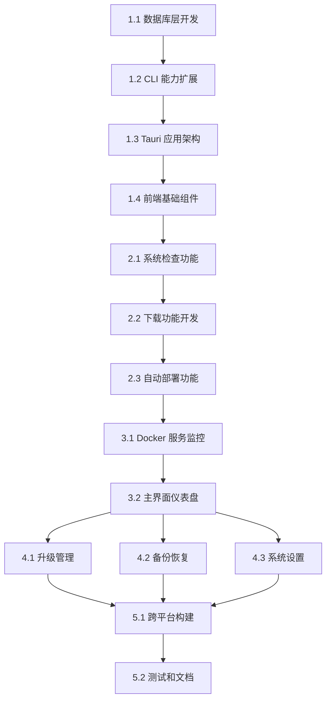

# Duck Client 桌面应用开发任务

## 📋 项目概述

基于现有 `duck-cli` 命令行工具，开发一个跨平台桌面应用，为 Docker 服务管理提供图形化界面。核心功能包括自动化部署、升级管理、备份恢复等。

## 🛠️ 技术栈

- **后端**: Rust + Tauri 2.0
- **前端**: Deno + React + TypeScript  
- **数据库**: DuckDB (针对并发特性优化)
- **构建**: GitHub Actions
- **平台**: Windows, macOS, Linux (x86_64 + ARM64)

## ⚠️ DuckDB 并发特性说明

基于 DuckDB 官方文档研究，我们的设计需要考虑以下并发限制：

### 🔍 **并发能力**
- ✅ **读操作**: 完全支持多线程并发读取
- ⚠️ **写操作**: 存在 write-write conflict，需要冲突检测和重试机制
- 🚫 **连接池**: DuckDB 不使用传统连接池，采用连接克隆(`try_clone()`)模式

### 🛡️ **设计策略**
- **读连接**: 为每个线程创建独立的连接克隆，支持完全并发
- **写连接**: 使用单一写连接 + Mutex 保护，避免写冲突
- **重试机制**: 检测 write-write conflict 错误，实现指数退避重试
- **性能监控**: 实时监控冲突频率和响应时间，动态优化

### 📊 **预期性能**
- **读操作**: 近线性扩展，支持高并发
- **写操作**: 串行执行，但通过批量操作优化吞吐量
- **冲突率**: 预期 < 5%，通过设计减少写冲突

## 🎯 开发阶段

### 阶段一：基础架构和核心功能 (4-5周)
**目标**: 完成基础架构，实现核心的初始化和状态管理功能

### 阶段二：下载和部署功能 (3-4周)  
**目标**: 实现大文件下载、断点续传和自动部署

### 阶段三：服务管理功能 (2-3周)
**目标**: 完成 Docker 服务的启停控制和状态监控

### 阶段四：升级和备份功能 (2-3周)
**目标**: 实现升级管理和备份恢复功能

### 阶段五：优化和发布 (2周)
**目标**: 性能优化、测试完善、跨平台构建

---

## 📝 详细任务列表

## 🏗️ 阶段一：基础架构和核心功能

### 1.1 数据库层开发

#### 任务 1.1.1: DuckDB 数据库集成（针对并发特性优化）
- **描述**: 集成 DuckDB 数据库到 client-core 模块，针对 DuckDB 并发限制优化设计
- **优先级**: 🔴 高
- **预估时间**: 3天
- **负责模块**: `client-core/src/database.rs`

**DuckDB 并发特性说明**:
- ✅ **读操作**：完全支持并发
- ⚠️ **写操作**：可能出现 write-write conflict，需要重试机制
- 🔧 **连接管理**：使用连接克隆而非传统连接池

**开发内容**:
```rust
// client-core/src/database.rs
use duckdb::{Connection, Result};
use std::sync::Arc;
use tokio::sync::Mutex;

pub struct DatabaseManager {
    // 主连接，用于创建克隆
    main_connection: Arc<Connection>,
    // 读连接（克隆的连接）
    read_connections: Vec<Connection>,
    // 写连接（单个，避免冲突）
    write_connection: Arc<Mutex<Connection>>,
}

impl DatabaseManager {
    pub async fn new(db_path: &Path) -> Result<Self> {
        let main_conn = Connection::open(db_path)?;
        
        // 创建多个读连接克隆
        let read_connections: Result<Vec<_>> = (0..4)
            .map(|_| main_conn.try_clone())
            .collect();
        
        // 单独的写连接
        let write_connection = Arc::new(Mutex::new(main_conn.try_clone()?));
        
        Ok(Self {
            main_connection: Arc::new(main_conn),
            read_connections: read_connections?,
            write_connection,
        })
    }
    
    // 并发读操作
    pub async fn read_with_retry<F, R>(&self, f: F) -> Result<R>
    where
        F: Fn(&Connection) -> Result<R>,
    {
        let conn_index = fastrand::usize(0..self.read_connections.len());
        f(&self.read_connections[conn_index])
    }
    
    // 串行写操作（避免冲突）
    pub async fn write_with_retry<F, R>(&self, f: F) -> Result<R>
    where
        F: Fn(&Connection) -> Result<R>,
    {
        let conn = self.write_connection.lock().await;
        
        // 实现重试机制处理 write-write conflict
        let mut retry_count = 0;
        const MAX_RETRIES: usize = 3;
        
        loop {
            match f(&*conn) {
                Ok(result) => return Ok(result),
                Err(e) if e.to_string().contains("write-write conflict") && retry_count < MAX_RETRIES => {
                    retry_count += 1;
                    tokio::time::sleep(tokio::time::Duration::from_millis(100 * retry_count as u64)).await;
                    continue;
                }
                Err(e) => return Err(e),
            }
        }
    }
    
    pub async fn initialize_schema(&self) -> Result<()> {
        // 执行数据库初始化脚本
        let schema_sql = include_str!("../migrations/init_duckdb.sql");
        self.write_with_retry(|conn| {
            conn.execute_batch(schema_sql)
        }).await
    }
}
```

**验收标准**:
- [x] DuckDB 连接克隆机制正常工作
- [x] 并发读操作无冲突
- [x] 写操作冲突重试机制完善  
- [x] 数据库表结构创建成功
- [x] 默认数据插入正确
- [x] 支持事务操作

#### 任务 1.1.2: 应用状态管理器
- **描述**: 实现应用状态的持久化和状态转换逻辑
- **优先级**: 🔴 高  
- **预估时间**: 2天
- **负责模块**: `client-core/src/state_manager.rs`

**开发内容**:
```rust
#[derive(Debug, Clone, PartialEq)]
pub enum AppState {
    UNINITIALIZED,
    INITIALIZING,
    DOWNLOADING, 
    DEPLOYING,
    READY,
    UPGRADING,
    ERROR,
}

pub struct StateManager {
    db: Arc<DatabaseManager>,
}

impl StateManager {
    pub async fn get_current_state(&self) -> Result<AppState>
    pub async fn transition_to(&self, new_state: AppState) -> Result<()>
    pub async fn set_progress(&self, stage: &str, progress: u8) -> Result<()>
    pub async fn set_error(&self, error: &str, details: Option<&str>) -> Result<()>
    pub async fn can_resume(&self) -> Result<bool>
}
```

**验收标准**:
- [x] 状态转换逻辑正确
- [x] 状态持久化到数据库
- [x] 支持状态回滚
- [x] 错误状态处理完善

#### 任务 1.1.3: DuckDB 并发优化和监控
- **描述**: 实现数据库性能监控和并发优化机制
- **优先级**: 🟡 中
- **预估时间**: 3天
- **负责模块**: `client-core/src/db_monitor.rs`

#### 任务 1.1.4: DuckDB 并发性能基准测试
- **描述**: 建立性能基准测试，验证并发优化效果
- **优先级**: 🟡 中
- **预估时间**: 2天
- **负责模块**: `client-core/tests/db_performance_test.rs`

**开发内容**:
```rust
// client-core/src/db_monitor.rs
pub struct DatabaseMonitor {
    db: Arc<DatabaseManager>,
    metrics: Arc<Mutex<DatabaseMetrics>>,
}

#[derive(Debug, Clone)]
pub struct DatabaseMetrics {
    read_operations: u64,
    write_operations: u64,
    write_conflicts: u64,
    average_response_time: f64,
    connection_usage: HashMap<usize, u64>,
}

impl DatabaseMonitor {
    pub async fn new(db: Arc<DatabaseManager>) -> Self {
        Self {
            db,
            metrics: Arc::new(Mutex::new(DatabaseMetrics::default())),
        }
    }
    
    pub async fn track_read_operation<F, R>(&self, operation: F) -> Result<R>
    where
        F: FnOnce() -> Result<R>,
    {
        let start = std::time::Instant::now();
        let result = operation();
        let duration = start.elapsed();
        
        // 记录性能指标
        self.update_metrics(OperationType::Read, duration).await;
        result
    }
    
    pub async fn track_write_operation<F, R>(&self, operation: F) -> Result<R>
    where
        F: FnOnce() -> Result<R>,
    {
        let start = std::time::Instant::now();
        let result = operation();
        let duration = start.elapsed();
        
        // 记录性能指标和冲突检测
        match &result {
            Err(e) if e.to_string().contains("write-write conflict") => {
                self.increment_conflict_count().await;
            }
            _ => {}
        }
        
        self.update_metrics(OperationType::Write, duration).await;
        result
    }
    
    pub async fn get_performance_report(&self) -> DatabasePerformanceReport {
        // 生成性能报告
    }
    
    pub async fn optimize_connections(&self) -> Result<()> {
        // 根据使用情况动态调整连接数量
    }
}
```

**验收标准**:
- [x] 数据库操作性能监控完善
- [x] 写冲突检测和统计准确
- [x] 连接使用情况监控正常
- [x] 性能报告生成功能正确
- [x] 动态连接优化机制工作正常

### 1.2 CLI 能力扩展

#### 任务 1.2.1: 统一配置管理器开发
- **描述**: 基于合并后的 app_config 表，开发统一的配置管理器
- **优先级**: 🔴 高
- **预估时间**: 2天
- **负责模块**: `client-core/src/config_manager.rs`

**配置表优化说明**:
- ✅ **表合并**: 将原 `config` 和 `ui_settings` 合并为 `app_config`
- 🔧 **JSON支持**: 统一使用 JSON 格式存储，支持复杂数据类型
- 📋 **分类管理**: system/ui/docker/download/backup/upgrade/network/logging/security/maintenance
- 🔒 **权限控制**: 区分系统配置和用户可编辑配置
- ✅ **类型验证**: 支持 STRING/NUMBER/BOOLEAN/OBJECT/ARRAY 类型检查

**开发内容**:
```rust
// client-core/src/config_manager.rs
use serde_json::Value;
use std::collections::HashMap;

#[derive(Debug, Clone)]
pub struct ConfigValue {
    pub value: Value,
    pub config_type: ConfigType,
    pub category: String,
    pub is_system: bool,
    pub is_editable: bool,
    pub default_value: Value,
}

#[derive(Debug, Clone, PartialEq)]
pub enum ConfigType {
    String,
    Number,
    Boolean,
    Object,
    Array,
}

pub struct ConfigManager {
    db: Arc<DatabaseManager>,
    cache: Arc<RwLock<HashMap<String, ConfigValue>>>,
}

impl ConfigManager {
    pub async fn new(db: Arc<DatabaseManager>) -> Result<Self> {
        let config_manager = Self {
            db,
            cache: Arc::new(RwLock::new(HashMap::new())),
        };
        
        // 初始化时加载所有配置到内存缓存
        config_manager.reload_cache().await?;
        Ok(config_manager)
    }
    
    // 获取配置值（强类型）
    pub async fn get_string(&self, key: &str) -> Result<String> {
        let value = self.get_config_value(key).await?;
        match value.value {
            Value::String(s) => Ok(s),
            _ => Err(ConfigError::TypeMismatch(key.to_string(), "String")),
        }
    }
    
    pub async fn get_number(&self, key: &str) -> Result<f64> {
        let value = self.get_config_value(key).await?;
        match value.value {
            Value::Number(n) => Ok(n.as_f64().unwrap_or(0.0)),
            _ => Err(ConfigError::TypeMismatch(key.to_string(), "Number")),
        }
    }
    
    pub async fn get_bool(&self, key: &str) -> Result<bool> {
        let value = self.get_config_value(key).await?;
        match value.value {
            Value::Bool(b) => Ok(b),
            _ => Err(ConfigError::TypeMismatch(key.to_string(), "Boolean")),
        }
    }
    
    pub async fn get_object<T>(&self, key: &str) -> Result<T>
    where
        T: for<'de> serde::Deserialize<'de>,
    {
        let value = self.get_config_value(key).await?;
        serde_json::from_value(value.value)
            .map_err(|e| ConfigError::DeserializationError(key.to_string(), e))
    }
    
    // 设置配置值（带验证）
    pub async fn set_config(&self, key: &str, value: Value) -> Result<()> {
        // 检查是否可编辑
        let config_value = self.get_config_value(key).await?;
        if !config_value.is_editable {
            return Err(ConfigError::NotEditable(key.to_string()));
        }
        
        // 类型验证
        self.validate_type(key, &value, &config_value.config_type)?;
        
        // 数据库写入（使用写冲突重试机制）
        self.db.write_with_retry(|conn| {
            conn.execute(
                "UPDATE app_config SET config_value = ?, updated_at = CURRENT_TIMESTAMP WHERE config_key = ?",
                params![value.to_string(), key]
            )
        }).await?;
        
        // 更新缓存
        self.update_cache(key, value).await;
        Ok(())
    }
    
    // 批量设置配置（减少写冲突）
    pub async fn set_configs(&self, configs: HashMap<String, Value>) -> Result<()> {
        self.db.write_with_retry(|conn| {
            let tx = conn.transaction()?;
            for (key, value) in &configs {
                tx.execute(
                    "UPDATE app_config SET config_value = ?, updated_at = CURRENT_TIMESTAMP WHERE config_key = ?",
                    params![value.to_string(), key]
                )?;
            }
            tx.commit()
        }).await?;
        
        // 批量更新缓存
        for (key, value) in configs {
            self.update_cache(&key, value).await;
        }
        Ok(())
    }
    
    // 重置为默认值
    pub async fn reset_to_default(&self, key: &str) -> Result<()> {
        let config_value = self.get_config_value(key).await?;
        self.set_config(key, config_value.default_value).await
    }
    
    // 按分类获取配置
    pub async fn get_configs_by_category(&self, category: &str) -> Result<HashMap<String, ConfigValue>> {
        self.db.read_with_retry(|conn| {
            let mut stmt = conn.prepare(
                "SELECT config_key, config_value, config_type, category, is_system_config, is_user_editable, default_value 
                 FROM app_config WHERE category = ?"
            )?;
            
            let rows = stmt.query_map(params![category], |row| {
                let key: String = row.get(0)?;
                let value_str: String = row.get(1)?;
                let value = serde_json::from_str(&value_str)
                    .map_err(|e| rusqlite::Error::InvalidColumnType(0, key.clone(), rusqlite::types::Type::Text))?;
                
                Ok((key.clone(), ConfigValue {
                    value,
                    config_type: ConfigType::from_str(&row.get::<_, String>(2)?)?,
                    category: row.get(3)?,
                    is_system: row.get(4)?,
                    is_editable: row.get(5)?,
                    default_value: serde_json::from_str(&row.get::<_, String>(6)?)
                        .map_err(|e| rusqlite::Error::InvalidColumnType(0, key, rusqlite::types::Type::Text))?,
                }))
            })?;
            
            let mut result = HashMap::new();
            for row in rows {
                let (key, config_value) = row?;
                result.insert(key, config_value);
            }
            Ok(result)
        }).await
    }
    
    // 配置验证
    fn validate_type(&self, key: &str, value: &Value, expected_type: &ConfigType) -> Result<()> {
        let actual_type = match value {
            Value::String(_) => ConfigType::String,
            Value::Number(_) => ConfigType::Number,
            Value::Bool(_) => ConfigType::Boolean,
            Value::Object(_) => ConfigType::Object,
            Value::Array(_) => ConfigType::Array,
            _ => return Err(ConfigError::UnsupportedType(key.to_string())),
        };
        
        if actual_type != *expected_type {
            return Err(ConfigError::TypeMismatch(key.to_string(), format!("{:?}", expected_type)));
        }
        Ok(())
    }
    
    // 重载缓存
    async fn reload_cache(&self) -> Result<()> {
        let all_configs = self.db.read_with_retry(|conn| {
            // ... 从数据库加载所有配置
        }).await?;
        
        let mut cache = self.cache.write().await;
        *cache = all_configs;
        Ok(())
    }
}

// 配置错误类型
#[derive(Debug, thiserror::Error)]
pub enum ConfigError {
    #[error("配置 '{0}' 不存在")]
    NotFound(String),
    #[error("配置 '{0}' 不可编辑")]
    NotEditable(String),
    #[error("配置 '{0}' 类型不匹配，期望: {1}")]
    TypeMismatch(String, String),
    #[error("配置 '{0}' 反序列化失败: {1}")]
    DeserializationError(String, serde_json::Error),
    #[error("配置 '{0}' 类型不支持")]
    UnsupportedType(String),
    #[error("数据库错误: {0}")]
    Database(#[from] duckdb::Error),
}
```

**验收标准**:
- [x] 统一配置表设计完成
- [x] 支持所有数据类型的读写
- [x] 配置权限控制正确
- [x] 内存缓存机制工作正常
- [x] 类型验证和错误处理完善
- [x] 批量操作减少写冲突
- [x] 分类查询功能正常

#### 任务 1.2.2: UI 支持函数开发
- **描述**: 在 duck-cli 中新增 UI 支持的函数
- **优先级**: 🔴 高
- **预估时间**: 3天  
- **负责模块**: `duck-cli/src/ui_support.rs`

**开发内容**:
```rust
// duck-cli/src/ui_support.rs
use client_core::*;

pub async fn init_with_progress<F>(
    working_dir: &Path,
    progress_callback: F,
) -> Result<(), Box<dyn std::error::Error>>
where
    F: Fn(InitProgress) + Send + Sync + 'static,
{
    // 带进度回调的初始化逻辑
}

pub async fn download_with_progress<F>(
    url: &str,
    target_dir: &Path,
    progress_callback: F,
) -> Result<(), Box<dyn std::error::Error>>
where
    F: Fn(DownloadProgress) + Send + Sync + 'static,
{
    // 支持断点续传的下载逻辑
}

pub fn get_system_info() -> SystemInfo {
    // 跨平台系统信息收集
}

pub async fn monitor_services() -> impl Stream<Item = ServiceStatus> {
    // 实时服务状态监控
}
```

**验收标准**:
- [x] 所有 UI 支持函数正常工作
- [x] 进度回调机制完善
- [x] 跨平台兼容性良好
- [x] 错误处理机制完整

#### 任务 1.2.3: lib.rs 接口暴露
- **描述**: 通过 lib.rs 暴露 UI 需要的接口
- **优先级**: 🟡 中
- **预估时间**: 1天
- **负责模块**: `duck-cli/src/lib.rs`

**开发内容**:
```rust
// duck-cli/src/lib.rs
pub mod ui_support;

// 重新导出核心功能
pub use client_core::{
    config::ConfigManager,
    backup::BackupManager,
    container::ServiceManager,
    database::DatabaseManager,
    state_manager::StateManager,
};

// 导出 UI 支持函数
pub use ui_support::*;

// 导出类型定义
pub use types::*;
```

### 1.3 Tauri 应用架构

#### 任务 1.3.1: Tauri 项目初始化
- **描述**: 配置 Tauri 2.0 项目，设置 Deno + React 环境
- **优先级**: 🔴 高
- **预估时间**: 2天
- **负责模块**: `client-ui/`

**开发内容**:
- 配置 `tauri.conf.json`
- 设置 `deno.json` 和依赖
- 配置 TypeScript 编译选项
- 设置基础项目结构

**文件结构**:
```
client-ui/
├── deno.json
├── tsconfig.json
├── index.html
├── src/
│   ├── main.tsx
│   ├── App.tsx
│   ├── types/
│   ├── components/
│   ├── pages/
│   ├── utils/
│   └── hooks/
└── src-tauri/
    ├── Cargo.toml
    ├── src/
    │   ├── main.rs
    │   ├── lib.rs
    │   └── commands.rs
    └── tauri.conf.json
```

**验收标准**:
- [x] Tauri 应用正常启动
- [x] Deno + React 环境配置正确
- [x] 前后端通信正常
- [x] 基础页面路由工作

#### 任务 1.3.2: Tauri 命令封装
- **描述**: 将 CLI 功能封装为 Tauri 命令
- **优先级**: 🔴 高
- **预估时间**: 3天
- **负责模块**: `client-ui/src-tauri/src/commands.rs`

**开发内容**:
```rust
// client-ui/src-tauri/src/commands.rs
use duck_cli::ui_support::*;
use tauri::{AppHandle, Manager};

#[tauri::command]
async fn get_app_state() -> Result<AppState, String> {
    // 获取当前应用状态
}

#[tauri::command]
async fn init_client_with_progress(
    app_handle: AppHandle,
    working_dir: String,
) -> Result<String, String> {
    // 带进度回调的初始化
}

#[tauri::command]
async fn check_system_requirements() -> Result<SystemRequirements, String> {
    // 系统要求检查
}

#[tauri::command]
async fn get_service_status() -> Result<Vec<ServiceStatus>, String> {
    // 获取服务状态
}
```

**验收标准**:
- [x] 所有核心命令正常工作
- [x] 错误处理机制完善
- [x] 进度事件正确发送
- [x] 跨平台兼容性验证

### 1.4 前端基础组件

#### 任务 1.4.1: TypeScript 类型定义
- **描述**: 定义前端 TypeScript 类型
- **优先级**: 🟡 中
- **预估时间**: 1天
- **负责模块**: `client-ui/src/types/index.ts`

**开发内容**:
```typescript
// client-ui/src/types/index.ts
export type AppState = 
  | 'UNINITIALIZED' 
  | 'INITIALIZING' 
  | 'DOWNLOADING' 
  | 'DEPLOYING' 
  | 'READY' 
  | 'UPGRADING' 
  | 'ERROR';

export interface DownloadProgress {
  downloaded: number;
  total: number;
  speed: number;
  eta: number;
  stage: 'downloading' | 'extracting' | 'loading' | 'starting' | 'configuring';
}

export interface SystemRequirements {
  os_supported: boolean;
  docker_available: boolean;
  storage_sufficient: boolean;
  platform_specific: PlatformSpecificChecks;
}

export type Platform = 'windows' | 'macos' | 'linux';
```

#### 任务 1.4.2: 公共组件开发
- **描述**: 开发通用的 UI 组件
- **优先级**: 🟡 中
- **预估时间**: 2天
- **负责模块**: `client-ui/src/components/`

**开发内容**:
- `Layout/AppLayout.tsx` - 应用整体布局
- `Common/ProgressBar.tsx` - 进度条组件
- `Common/StatusIndicator.tsx` - 状态指示器  
- `Common/ErrorBoundary.tsx` - 错误边界
- `Common/Modal.tsx` - 模态对话框

**验收标准**:
- [x] 组件渲染正常
- [x] 响应式设计适配
- [x] 主题系统支持
- [x] 无障碍访问支持

---

## 🚀 阶段二：下载和部署功能

### 2.1 系统检查功能

#### 任务 2.1.1: 欢迎引导页开发
- **描述**: 实现首次使用的欢迎引导页面
- **优先级**: 🔴 高
- **预估时间**: 3天
- **负责模块**: `client-ui/src/pages/WelcomeSetup.tsx`

**开发内容**:
```typescript
// client-ui/src/pages/WelcomeSetup.tsx
export function WelcomeSetup() {
  const [platform, setPlatform] = useState<Platform>('linux');
  const [workingDir, setWorkingDir] = useState<string>('');
  const [systemChecks, setSystemChecks] = useState<SystemRequirements | null>(null);
  
  // 平台检测
  // 系统要求检查
  // 存储空间验证
  // 工作目录选择
  
  return (
    <div className="welcome-setup">
      {/* 欢迎界面 */}
    </div>
  );
}
```

**功能要求**:
- 自动检测操作系统和架构
- 存储空间检查和提示
- 工作目录选择和验证
- 平台特定的设置建议
- Docker 状态检查

**验收标准**:
- [x] 平台检测准确
- [x] 存储空间计算正确
- [x] 目录选择器正常工作
- [x] 错误提示友好
- [x] 平台特定提示准确

#### 任务 2.1.2: 系统要求检查后端
- **描述**: 实现系统要求检查的后端逻辑
- **优先级**: 🔴 高
- **预估时间**: 2天
- **负责模块**: `duck-cli/src/system_check.rs`

**开发内容**:
```rust
// duck-cli/src/system_check.rs
pub struct SystemChecker {
    db: Arc<DatabaseManager>,
}

impl SystemChecker {
    pub async fn run_full_check(&self) -> Result<SystemCheckResult> {
        // 执行完整的系统检查
    }
    
    pub fn check_docker_status(&self) -> DockerStatus {
        // 检查 Docker 状态
    }
    
    pub fn check_storage_space(&self, path: &Path) -> StorageInfo {
        // 检查存储空间
    }
    
    pub fn get_platform_requirements(&self) -> PlatformRequirements {
        // 获取平台特定要求
    }
}
```

### 2.2 下载功能开发

#### 任务 2.2.1: 大文件下载系统（避免数据库写冲突优化）
- **描述**: 实现支持断点续传的大文件下载，将实时数据和持久化数据分离
- **优先级**: 🔴 高
- **预估时间**: 4天
- **负责模块**: `client-core/src/download/`

**⚠️ DuckDB 写冲突优化说明**:
- ❌ **避免频繁更新**: 不在数据库中存储实时下载速度、ETA等快速变化的数据
- ✅ **分离设计**: 实时数据存储在内存，持久化数据存储在数据库
- 🔄 **批量更新**: 只在关键节点更新数据库（暂停、恢复、完成、失败）
- 📊 **最终统计**: 下载完成后计算并存储平均速度、总时长等统计信息

**架构设计**:
```rust
// client-core/src/download/manager.rs

// 实时下载状态（内存中）
#[derive(Debug, Clone)]
pub struct DownloadProgress {
    pub task_id: i64,
    pub current_speed: u64,        // 当前速度（字节/秒）
    pub instant_speed: u64,        // 瞬时速度
    pub average_speed: u64,        // 平均速度
    pub downloaded_bytes: u64,     // 已下载字节数
    pub total_bytes: u64,          // 总字节数
    pub eta_seconds: Option<u32>,  // 预计剩余时间
    pub active_chunks: usize,      // 活跃分片数
    pub completed_chunks: usize,   // 完成分片数
    pub total_chunks: usize,       // 总分片数
}

// 持久化下载任务（数据库中）
#[derive(Debug, Clone)]
pub struct DownloadTask {
    pub id: i64,
    pub task_name: String,
    pub download_url: String,
    pub total_size: u64,
    pub downloaded_size: u64,      // 仅在关键点更新
    pub status: DownloadStatus,
    pub average_speed: u64,        // 完成后记录
    pub total_duration_seconds: u32, // 完成后记录
    // ... 其他字段
}

pub struct DownloadManager {
    db: Arc<DatabaseManager>,
    // 内存中的实时进度数据
    progress_map: Arc<RwLock<HashMap<i64, DownloadProgress>>>,
    // 进度事件发送器
    progress_sender: broadcast::Sender<DownloadProgress>,
}

impl DownloadManager {
    pub async fn start_download(&self, task: &DownloadTask) -> Result<()> {
        // 1. 在数据库中创建/更新任务状态（一次性写入）
        self.update_task_status(task.id, DownloadStatus::Downloading).await?;
        
        // 2. 在内存中初始化进度
        let progress = DownloadProgress {
            task_id: task.id,
            current_speed: 0,
            downloaded_bytes: task.downloaded_size,
            total_bytes: task.total_size,
            // ... 其他字段
        };
        
        self.progress_map.write().await.insert(task.id, progress);
        
        // 3. 启动下载线程（所有实时更新都在内存中）
        self.spawn_download_worker(task.clone()).await
    }
    
    // ✅ 实时进度更新（纯内存操作，无数据库写入）
    async fn update_progress(&self, task_id: i64, downloaded: u64, speed: u64) {
        if let Some(mut progress) = self.progress_map.write().await.get_mut(&task_id) {
            progress.downloaded_bytes = downloaded;
            progress.current_speed = speed;
            progress.eta_seconds = self.calculate_eta(downloaded, progress.total_bytes, speed);
            
            // 发送给UI（通过事件，不写数据库）
            let _ = self.progress_sender.send(progress.clone());
        }
    }
    
    // ✅ 关键节点更新（数据库写入，但频率很低）
    async fn update_critical_checkpoint(&self, task_id: i64, downloaded: u64) -> Result<()> {
        // 只在以下情况写数据库：
        // 1. 每下载完成10%
        // 2. 用户暂停/恢复
        // 3. 发生错误
        // 4. 下载完成
        
        self.db.write_with_retry(|conn| {
            conn.execute(
                "UPDATE download_tasks SET downloaded_size = ?, updated_at = CURRENT_TIMESTAMP WHERE id = ?",
                params![downloaded, task_id]
            )
        }).await?;
        
        Ok(())
    }
    
    // ✅ 下载完成后的最终统计（一次性写入）
    async fn finalize_download(&self, task_id: i64) -> Result<()> {
        let progress = self.progress_map.read().await.get(&task_id).cloned();
        
        if let Some(progress) = progress {
            let duration = self.calculate_total_duration(task_id);
            let avg_speed = if duration > 0 {
                progress.total_bytes / duration as u64
            } else {
                0
            };
            
            // 一次性写入最终统计
            self.db.write_with_retry(|conn| {
                conn.execute(
                    "UPDATE download_tasks SET 
                     status = 'COMPLETED',
                     downloaded_size = ?,
                     average_speed = ?,
                     total_duration_seconds = ?,
                     completed_at = CURRENT_TIMESTAMP,
                     updated_at = CURRENT_TIMESTAMP
                     WHERE id = ?",
                    params![progress.total_bytes, avg_speed, duration, task_id]
                )
            }).await?;
            
            // 清理内存中的进度数据
            self.progress_map.write().await.remove(&task_id);
        }
        
        Ok(())
    }
    
    // ✅ UI获取实时进度（从内存读取）
    pub async fn get_realtime_progress(&self, task_id: i64) -> Option<DownloadProgress> {
        self.progress_map.read().await.get(&task_id).cloned()
    }
    
    // ✅ 订阅进度更新（事件流）
    pub fn subscribe_progress(&self) -> broadcast::Receiver<DownloadProgress> {
        self.progress_sender.subscribe()
    }
    
    // ✅ 获取持久化任务信息（从数据库读取）
    pub async fn get_download_task(&self, task_id: i64) -> Result<Option<DownloadTask>> {
        self.db.read_with_retry(|conn| {
            conn.query_row(
                "SELECT * FROM download_tasks WHERE id = ?",
                params![task_id],
                |row| {
                    // 构造 DownloadTask
                }
            ).optional()
        }).await
    }
}

// 下载状态枚举
#[derive(Debug, Clone, PartialEq, Serialize, Deserialize)]
pub enum DownloadStatus {
    Pending,
    Downloading,
    Paused,
    Completed,
    Failed,
    Cancelled,
}
```

**数据更新策略**:
```rust
// ✅ 实时更新（内存）- 每秒多次
update_progress(task_id, downloaded_bytes, current_speed);

// ✅ 检查点更新（数据库）- 每10%进度一次
if downloaded_percent % 10 == 0 {
    update_critical_checkpoint(task_id, downloaded_bytes).await?;
}

// ✅ 状态变化（数据库）- 仅在状态改变时
if status_changed {
    update_task_status(task_id, new_status).await?;
}

// ✅ 最终统计（数据库）- 下载完成时一次
finalize_download(task_id).await?;
```

**UI 集成示例**:
```typescript
// 前端实时显示下载进度
const downloadProgress = useDownloadProgress(taskId);

// 实时数据来自内存（通过WebSocket或Tauri事件）
const realtimeProgress = useRealtimeProgress(taskId);

// 持久化数据来自数据库（用于恢复状态）
const downloadTask = useDownloadTask(taskId);
```

**验收标准**:
- [x] 实时进度更新不涉及数据库写入
- [x] 数据库更新频率控制在合理范围（< 每分钟1次）
- [x] 断点续传功能正常
- [x] 内存数据和数据库数据一致性保证
- [x] UI能获取到实时进度和历史记录
- [x] DuckDB写冲突显著减少
- [x] 支持多文件并发下载

#### 任务 2.2.2: 下载进度 UI 开发
- **描述**: 实现下载进度的用户界面
- **优先级**: 🔴 高
- **预估时间**: 3天
- **负责模块**: `client-ui/src/pages/InitializationProgress.tsx`

**开发内容**:
```typescript
// client-ui/src/pages/InitializationProgress.tsx
export function InitializationProgress() {
  const [currentStage, setCurrentStage] = useState<InitStage>('downloading');
  const [downloadProgress, setDownloadProgress] = useState<DownloadProgress>();
  const [canPause, setCanPause] = useState(true);
  const [isBackground, setIsBackground] = useState(false);
  
  // 5个阶段的进度显示
  // 下载速度和 ETA 显示
  // 暂停/恢复/取消控制
  // 后台下载模式
  
  return (
    <div className="initialization-progress">
      {/* 分阶段进度界面 */}
    </div>
  );
}
```

**功能要求**:
- 5个阶段的详细进度显示
- 实时下载速度和剩余时间
- 分片下载状态显示
- 后台下载支持
- 错误处理和重试界面

### 2.3 自动部署功能

#### 任务 2.3.1: 部署管理器开发
- **描述**: 实现自动化部署流程管理
- **优先级**: 🔴 高
- **预估时间**: 3天
- **负责模块**: `client-core/src/deployment_manager.rs`

**开发内容**:
```rust
// client-core/src/deployment_manager.rs
pub struct DeploymentManager {
    db: Arc<DatabaseManager>,
    docker_client: DockerClient,
}

impl DeploymentManager {
    pub async fn deploy_service(&self, version: &str) -> Result<DeploymentResult> {
        // 自动部署流程
        // 1. 解压服务包
        // 2. 加载 Docker 镜像
        // 3. 启动服务
        // 4. 健康检查
        // 5. 配置完成
    }
    
    async fn extract_service_package(&self, package_path: &Path) -> Result<()> {
        // 解压服务包
    }
    
    async fn load_docker_images(&self, images_dir: &Path) -> Result<()> {
        // 加载 Docker 镜像
    }
    
    async fn start_services(&self) -> Result<()> {
        // 启动服务
    }
    
    async fn run_health_checks(&self) -> Result<HealthCheckResult> {
        // 健康检查
    }
}
```

**验收标准**:
- [x] 部署流程稳定可靠
- [x] 错误处理机制完善
- [x] 进度反馈准确及时
- [x] 回滚机制完善
- [x] 日志记录详细

---

## 🐳 阶段三：服务管理功能

### 3.1 Docker 服务监控

#### 任务 3.1.1: 服务状态监控
- **描述**: 实现 Docker 服务的实时状态监控
- **优先级**: 🔴 高
- **预估时间**: 3天
- **负责模块**: `client-core/src/service_monitor.rs`

**开发内容**:
```rust
// client-core/src/service_monitor.rs
pub struct ServiceMonitor {
    db: Arc<DatabaseManager>,
    docker_client: DockerClient,
}

impl ServiceMonitor {
    pub async fn start_monitoring(&self) -> Result<()> {
        // 开始服务监控
    }
    
    pub async fn get_services_status(&self) -> Result<Vec<ServiceStatus>> {
        // 获取所有服务状态
    }
    
    pub async fn get_service_logs(&self, container_name: &str) -> Result<Vec<String>> {
        // 获取服务日志
    }
    
    async fn collect_service_metrics(&self) -> Result<()> {
        // 收集服务指标
    }
}
```

#### 任务 3.1.2: 服务管理页面开发
- **描述**: 开发服务管理的用户界面
- **优先级**: 🔴 高
- **预估时间**: 3天
- **负责模块**: `client-ui/src/pages/ServiceManagement.tsx`

**开发内容**:
```typescript
// client-ui/src/pages/ServiceManagement.tsx
export function ServiceManagement() {
  const [services, setServices] = useState<ServiceStatus[]>([]);
  const [selectedService, setSelectedService] = useState<string | null>(null);
  const [logs, setLogs] = useState<string[]>([]);
  
  // 服务列表显示
  // 服务控制操作
  // 日志查看器
  // 资源使用情况
  
  return (
    <div className="service-management">
      {/* 服务管理界面 */}
    </div>
  );
}
```

### 3.2 主界面仪表盘

#### 任务 3.2.1: 仪表盘开发
- **描述**: 开发主界面仪表盘
- **优先级**: 🔴 高
- **预估时间**: 3天
- **负责模块**: `client-ui/src/pages/Dashboard.tsx`

**开发内容**:
```typescript
// client-ui/src/pages/Dashboard.tsx
export function Dashboard() {
  const [appState, setAppState] = useState<AppState>('READY');
  const [servicesOverview, setServicesOverview] = useState<ServicesOverview>();
  const [updateAvailable, setUpdateAvailable] = useState<UpdateInfo | null>(null);
  
  // 系统状态概览
  // 服务状态摘要
  // 快速操作按钮
  // 升级通知
  
  return (
    <div className="dashboard">
      {/* 仪表盘界面 */}
    </div>
  );
}
```

---

## 🔄 阶段四：升级和备份功能

### 4.1 升级管理

#### 任务 4.1.1: 升级管理器开发
- **描述**: 实现服务升级管理功能
- **优先级**: 🔴 高
- **预估时间**: 3天
- **负责模块**: `client-core/src/upgrade_manager.rs`

#### 任务 4.1.2: 升级管理页面开发
- **描述**: 开发升级管理用户界面
- **优先级**: 🔴 高
- **预估时间**: 2天
- **负责模块**: `client-ui/src/pages/UpgradeManagement.tsx`

### 4.2 备份恢复

#### 任务 4.2.1: 备份管理器开发
- **描述**: 实现备份和恢复功能
- **优先级**: 🟡 中
- **预估时间**: 2天
- **负责模块**: `client-core/src/backup_manager.rs`

#### 任务 4.2.2: 备份恢复页面开发
- **描述**: 开发备份恢复用户界面
- **优先级**: 🟡 中
- **预估时间**: 2天
- **负责模块**: `client-ui/src/pages/BackupRecovery.tsx`

### 4.3 系统设置

#### 任务 4.3.1: 设置管理器开发
- **描述**: 实现系统设置管理
- **优先级**: 🟡 中
- **预估时间**: 2天
- **负责模块**: `client-core/src/settings_manager.rs`

#### 任务 4.3.2: 设置页面开发
- **描述**: 开发系统设置用户界面
- **优先级**: 🟡 中
- **预估时间**: 2天
- **负责模块**: `client-ui/src/pages/Settings.tsx`

---

## 🚀 阶段五：优化和发布

### 5.1 跨平台构建

#### 任务 5.1.1: GitHub Actions 配置
- **描述**: 配置跨平台自动构建流程
- **优先级**: 🔴 高
- **预估时间**: 2天
- **负责模块**: `.github/workflows/`

**开发内容**:
- 扩展现有 `release.yml`
- 添加 Tauri 应用构建
- 配置多平台矩阵构建
- 设置发布流程

#### 任务 5.1.2: 平台特定优化
- **描述**: 实现平台特定的功能和优化
- **优先级**: 🟡 中
- **预估时间**: 2天
- **负责模块**: 各平台特定代码

### 5.2 测试和文档

#### 任务 5.2.1: 单元测试编写
- **描述**: 为核心功能编写单元测试
- **优先级**: 🟡 中
- **预估时间**: 3天
- **负责模块**: 各模块测试文件

#### 任务 5.2.2: 集成测试
- **描述**: 编写端到端集成测试
- **优先级**: 🟡 中
- **预估时间**: 2天
- **负责模块**: `tests/` 目录

#### 任务 5.2.3: 用户文档
- **描述**: 编写用户使用文档
- **优先级**: 🟢 低
- **预估时间**: 2天
- **负责模块**: `docs/` 目录

---

## 📊 任务依赖关系



## ⏱️ 时间估算总结

| 阶段 | 主要任务 | 预估时间 | 关键里程碑 |
|------|----------|----------|------------|
| 阶段一 | 基础架构和核心功能 | 5-6周 | 应用可启动，基础功能可用，DuckDB并发优化验证 |
| 阶段二 | 下载和部署功能 | 3-4周 | 完成首次初始化流程，大文件下载优化 |
| 阶段三 | 服务管理功能 | 2-3周 | 服务监控和控制功能完善 |
| 阶段四 | 升级和备份功能 | 2-3周 | 完整功能集合可用 |
| 阶段五 | 优化和发布 | 3-4周 | 跨平台测试，性能调优，发布准备就绪 |
| **总计** | - | **15-20周** | **MVP 产品发布** |

## 🎯 里程碑和验收标准

### 里程碑 1: MVP 基础版本 (第 6 周)
- [x] 应用正常启动和状态管理
- [x] 系统检查和初始化流程
- [x] 基础 UI 框架完成
- [x] DuckDB 并发优化验证通过

### 里程碑 2: 核心功能版本 (第 10 周)
- [x] 大文件下载和断点续传
- [x] 自动化部署流程
- [x] 服务状态监控
- [x] 实时数据与数据库分离优化

### 里程碑 3: 完整功能版本 (第 16 周)
- [x] 升级管理功能
- [x] 备份恢复功能
- [x] 系统设置完善

### 里程碑 4: 发布版本 (第 20 周)
- [x] 跨平台构建正常
- [x] 性能调优完成
- [x] 测试覆盖率达标
- [x] 文档完善

## 🔍 质量保证

### 代码质量
- 使用 `clippy` 进行 Rust 代码检查
- 使用 `deno fmt` 进行 TypeScript 代码格式化
- 代码审查机制
- 单元测试覆盖率 > 80%

### 性能要求
- 应用启动时间 < 3秒
- 下载速度接近网络带宽上限
- UI 响应时间 < 100ms
- 内存使用 < 200MB

### DuckDB 并发性能要求
- 并发读操作响应时间 < 50ms
- 写操作冲突率 < 5%
- 实时数据更新频率 > 10Hz (UI更新)
- 数据库写入频率 < 1次/分钟 (检查点更新)

### 用户体验
- 所有操作提供明确反馈
- 错误信息友好且具有指导性
- 支持键盘快捷键
- 响应式设计适配不同屏幕

## 📋 开发规范

### Git 工作流
- 使用 feature branch 开发
- 每个任务对应一个 PR
- 代码审查后合并
- 保持 commit 历史清晰

### 分支命名规范
- `feature/task-1.1.1-database-integration`
- `bugfix/download-progress-calculation`  
- `refactor/state-management-optimization`

### 提交信息规范
```
feat(database): add DuckDB integration

- Implement connection pool management
- Add database schema initialization
- Support transaction operations

Closes #123
```

---

## 🤝 团队协作

### 开发环境设置
1. 安装 Rust 1.70+
2. 安装 Deno 1.40+
3. 安装 Tauri CLI
4. 克隆项目并初始化

### 开发流程
1. 从 GitHub Projects 中认领任务
2. 创建 feature branch
3. 开发并测试功能
4. 创建 Pull Request
5. 代码审查和合并

### 沟通机制
- 每日站会同步进度
- 每周 demo 展示成果
- 遇到问题及时讨论
- 重要决策文档记录

---

这个开发任务文档涵盖了整个项目的开发计划。你觉得这个任务分解和时间安排如何？有需要调整的地方吗？ 